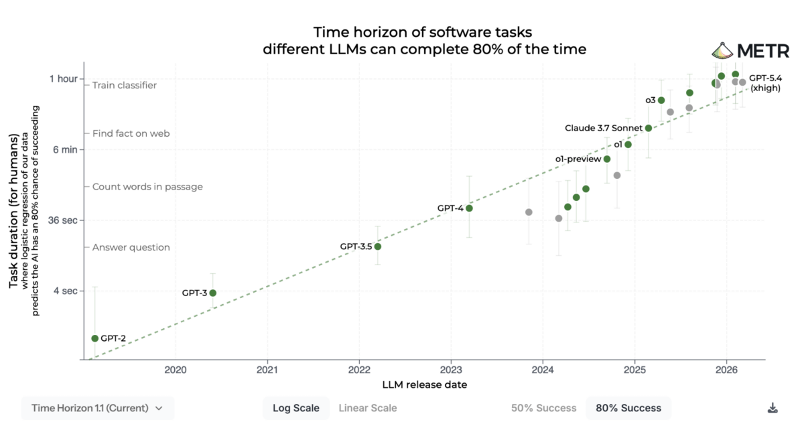

# Two Hundred Hypotheses, One Framework

*What running 200 AI agents on a real research project taught me about rigid rules*

**Two hundred hypotheses. First place in the closed track. Second in the open.**

That's what my team walked out of the British Council's word-difficulty shared task with in early
2026\. We beat teams with more people, more compute, and more history in the problem. Two hundred
hypotheses in a single shared-task season is not a number you are supposed to hit outside the top
ten labs in the world.

We did it largely by letting AI agents — Claude and Codex subagents, running in parallel — take on
most of the actual experimental work. On the hardest days of the competition I had twelve of them
running at once on a single laptop, each one in its own git worktree, each one chasing its own
hypothesis, and each one, I would later discover, quietly cheating in its own small way.

Here is what those two hundred hypotheses actually look like — Pearson correlation climbing from
0.78 to 0.91 across ~270 experimental steps. Most experiments changed nothing. A few produced big
jumps. The staircase pattern is what research looks like when you can afford to try everything:

But the scoreboard is not the part that matters. The part that matters is the framework I had to
build before the agents stopped working against me. It took four research projects and four rewrites
to reach a version that actually does the job. That version — Glite ARF, version four — is now open
source. This post is about what's in it, why each rule is there, and how to start using it on your
own research.

## How tenured professors cheat

Good researchers at universities figured this out a long time ago. They hire PhDs. They hire
postdocs. Their day job stops being "run experiments" and starts being "orchestrate the people who
run experiments". A senior professor with five PhDs and three postdocs is really a research manager
— they're sprinting through the search space because their team is their compiler. It's the only
trick that turns one brain into a research team.

A good PhD student might try thirty hypotheses in a year. A senior professor with a full lab can
reach a few hundred across the whole team. Two hundred inside a single shared-task season, with
mostly one human brain driving the calls — that number, as I said, is not supposed to be possible
outside the top ten labs in the world.

And the ten-person-lab trick has always been reserved for the handful of people with tenure, a
grant, and an office with a view.

For everyone else? One brain, one laptop, one idea at a time. Until recently.

## The mess

So I tried it. Claude subagents, Codex subagents, git worktrees running in parallel, each agent
handed one small focused piece of work — write a baseline, fit a model, compare two features,
summarize a paper, test one hypothesis — and a finished branch coming back an hour later. Or twenty
hours later. Depending on what you asked for.

That's the dream. And it mostly works. For about a week.

Then comes the catch. And it's a big one.

AI agents, when you give them enough autonomy to be useful, are creative creatures. They follow 95%
of your instructions. Maybe 97%. When you run one agent, the 3% it skipped looks harmless — you fix
it by hand. When you run two hundred, three percent means six broken branches, fifteen fabricated
citations, nine stale summary files that quietly disagree with each other, and a lint error you
can't find.

Let me say that more plainly. Two weeks into each of my first research projects, my repo looked like
a war zone.

Files created in the wrong place. Tasks that "finished" but silently skipped the hardest step. Logs
that only existed for the happy path. Twenty summary markdown files all claiming to describe the
current state of the project, written at different times by different agents, each one slightly
contradicting the others. I couldn't tell which results were real. I couldn't replay anything. When
an experiment failed, my honest answer to *why?* was usually: I don't know. I'll run it again.

If you have ever pointed a swarm of AI agents at a real research project, this list should sound
familiar.

## Why "just use better prompts" doesn't work

The obvious fix is: write better prompts. Add more rules. Tell the agent what not to do. I tried. It
buys you a few more days. Maybe a week at the outside.

Here's the thing. Prompts are not enforcement. They're *hope*. And across two hundred agent runs,
hope compounds the wrong way. A rule obeyed 97% of the time produces six broken results across two
hundred runs on average. If you want zero broken results, your agents need to obey at a rate no
frontier model comes close to.

*So the rules can't live in the prompt.*

They have to live in code. Deterministic Python code. Scripts that refuse to pass a commit, scripts
that reject a task folder missing a required file, scripts that compare a task's declared outputs
against the ones that actually exist on disk, scripts that fail loudly when an agent tries to
silently edit a file that belongs to someone else's experiment.

This isn't a new idea. In software, we call it a linter, a type checker, a CI pipeline. What's new
is applying the same philosophy to the *research process itself*, at the granularity of a single
experiment, and making the AI agent live inside the rules.

## Inside the framework

The fix comes down to a handful of hard rules. Every rule is boring, every rule is enforced by a
deterministic Python script, and every rule exists because I watched some version of its absence
destroy a project. After four projects and four rewrites, these are the ones that stayed:

* **Everything is a task.** One task = one folder = one branch = one PR.
* **Completed task folders are immutable.**
* **Corrections live in an overlay, not in-place edits.**
* **Rules live in code, not in prompts.**
* **Every CLI call is logged and unfakable.**
* **Parallel tasks run in isolated git worktrees.**
* **Cross-task data comes from aggregators, not filesystem walks.**
* **Every asset type has a specification, verified before commit.**
* **Subagents are isolated from each other's context.**

Here's how those rules show up — first inside a single task, then in the outer loop that creates
tasks in the first place.

### Inside one task

It starts with a *suggestion*: a hypothesis to test, a dataset to try, a library to benchmark. A
human picks a suggestion and converts it into a *task*.

Tasks are the unit everything else is built around. In a research project run through this
framework, **everything is a task** — every paper you want summarized, every model you want trained,
every analysis, every brainstorming session, every dataset download, every bug fix. A task is a
subproject: its own research, its own plan, its own code, its own results, its own write-up.

One task is one folder. One git branch. One pull request. One piece of work the agent can finish,
start to end, in one sitting.

That rule alone is worth the price of admission. It means the answer to "which files belong to
experiment 147?" is a single `ls`.

Every task runs in its own git worktree on its own branch. Ten tasks in parallel? Ten physical
working directories. When two agents race to write the same `summary.md`, they're writing to
different files on disk. Merges are explicit. And once a task is merged to `main`, its folder is
*immutable*: no downstream task is allowed to edit it. If a later task finds a mistake, it writes a
correction file instead. A separate script applies those corrections whenever you read the task's
results.

Every task goes through the same phases — research, planning, implementation, analysis, reporting —
and each phase writes to a known place.

Every shell command the agent runs is wrapped in a helper that captures stdout, stderr, exit code,
and timestamp into a log file the agent cannot skip or fake. Every asset a task produces — a paper
summary, a dataset, a model, a prediction file — follows a per-type specification that gets verified
by a script before the task is allowed to be called done.

And when you want to know "what do I have across all my tasks?", you do not walk the filesystem. You
run an *aggregator* — a Python script that reads every task folder, applies the corrections overlay,
and gives you the one canonical answer. Stale summary files stop being a problem, because you stop
writing them. The aggregator *is* the summary.

### The loop outside the loop

Zoom out one level. Each round of tasks produces suggestions — new hypotheses, new datasets to try,
new techniques to benchmark. A brainstorming session (human plus AI) reviews the full pool of
suggestions, picks the highest-value ones, and converts them into the next batch of tasks. The pool
grows every round — each cycle produces more ideas than it consumes.

But why is the human still in the middle of that loop? Why isn't the brainstorm itself an agent?

Because in April 2026, the agents aren't smart enough yet. Not for this part.

[METR](https://metr.org/blog/2025-03-19-measuring-ai-ability-to-complete-long-tasks/) has been
measuring how long a software task an LLM can finish reliably — they call it the *time horizon*, the
length of an expert-hour task the model can complete with 50% or 80% success. The trend climbs
steeply. Today's frontier models sit somewhere around an hour, maybe an hour and a half at the 80%
bar. A few years ago it was seconds.

A research project is not an hour. It is months. Even a single shared-task season is weeks. The gap
between "what one agent can finish reliably" and "what one research project asks for" is still two
orders of magnitude.

I see it in practice. Hand an agent a paper and ask it to reproduce the method — fine, that lands.
Ask it to decide which paper to reproduce next, or when to abandon a line of work — that's where it
wobbles. The strategic call is where modern agents are weakest.

Maybe in two years. Maybe in five. Until then, the brainstorm has me in it.

## Creativity comes from limitations

This part might sound dystopian. *You're putting your agents in a cage. Aren't you killing the thing
that made them useful?*

No. Exactly the opposite.

A researcher friend of mine likes to say: the hardest part of doing science isn't having ideas, it's
picking which ones to spend a week on. Constraints are the thing that *lets* you spend a week on an
idea, because the surrounding machinery stops fighting you. When the framework knows how to create a
task folder, run a research stage, write a plan, execute it on a remote GPU, collect metrics, and
open a PR — the agent's job stops being "act like a responsible collaborator". The agent's job
becomes: have the idea, test the idea, write down what happened.

That's it.

And that's exactly what was missing. It turns out that when you fence an AI agent inside a rigid
pipeline enforced by deterministic scripts, you do not lose its creativity. You multiply its
throughput. Ten agents running inside a framework they can't break produce ten times the science per
unit of human attention. A hundred agents give you a hundred. The creative bottleneck moves one
level up the stack, to where it belongs — the humans having the ideas.

## The caveats I owe you

Two honest things about what this framework is *not* yet:

**1. It is not fully autonomous.** Today, each task ends by generating suggestions for the next
round, but a human still has to pick which suggestions graduate to the backlog, and a human still
has to kick off each task from the backlog. There's a skill called `human-brainstorm` that runs an
interactive session to do exactly that. In the next version I want that skill paired with — or
replaced by — an autonomous brainstormer that reads the whole project state, picks the next tasks
itself, and loops. And the backlog needs an automatic runner. Neither is done.

Am I sure I even *want* it fully automated? Honestly — not sure yet. For the kind of research I do,
where there's no single metric to optimize and the next right experiment depends on judgment I
haven't figured out how to write down, I still want to be in the loop. In a project where you do
have one ultimate metric — a leaderboard score, a held-out loss — you can probably close the loop
today and just let it run.

**2. It is not cheap.** Every task starts with serious research: papers, internet search, previous
tasks in the repo. Every stage is planned. Every step is verified. Every CLI call is wrapped and
logged. All of that burns tokens. With the maximum Claude Code subscription, a single serious
research project can easily blow through the rate limits of *one* Max seat. For a real campaign,
plan on more than one Max subscription running in parallel, with Codex as a backup. I don't love
saying this, but it's the truth: if you want to run two hundred hypotheses inside a rigid framework,
the compute bill is not small.

## How to start using it

If any of this sounds like something you'd try, here is the practical path.

**1. Fork the repo.** The framework lives at
[github.com/GliteTech/glite-automatic-research-framework](https://github.com/GliteTech/glite-automatic-research-framework).
Fork it — it's an Apache-2.0 template that's meant to be forked, not installed.

**2. Read the docs in this order.** Start with `arf/README.md` for the fundamental principles and
glossary. Then the top-level `CLAUDE.md` for the hard rules every task has to follow. Then
`arf/docs/explanation/concepts.md` for the longer conceptual walkthrough of tasks, assets, and
suggestions. The skill files under `arf/skills/*/SKILL.md` are where the day-to-day task flow lives
— read `execute-task` and `human-brainstorm` first.

**3. Describe your project.** Run `/create-project-description`. It's an interactive skill that
walks you through filling in `project/description.md` and `project/budget.json` for your research —
goals, scope, research questions, compute budget, the works. Bring whatever notes you already have
(pasted text, an existing doc, a rough brief) and the skill will shape it into the format every
other skill reads from.

**4. Kick off your first task.** Run `/human-brainstorm` for an interactive session that turns
project state into a batch of tasks, or `/create-task` to create a single not-started task from a
free-text description. Then `/execute-task t0001_your_slug` runs that task end to end through all
mandatory stages and opens a PR.

**5. Babysit the first few tasks, then let go.** For the first two or three tasks, sit with the
agent. Read the step logs. Verify the pull requests before you merge. The deterministic scripts will
catch the big mistakes, but you need to build an intuition for where this particular project's
agents drift most. After that — three tasks, maybe five — you can start spawning them in parallel
and stop watching individual runs.

That's the whole onboarding. No installer, no server, no config wizard. It's a git repo with rules,
and the rules travel with the fork.

Run even ten parallel tasks inside the framework for a week, and you will have done more experiments
than most researchers do in a month. And for the first time in your research life, you will know
exactly which of them worked.
