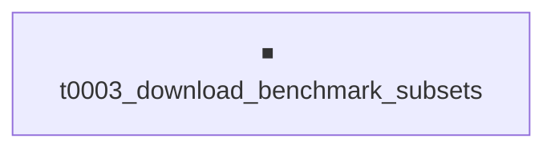

# Project Tasks

3 tasks. ⏹ **1 not_started**, ✅ **2 completed**.

**Browse by view**: By status: [⏹ `not_started`](by-status/not_started.md), [✅
`completed`](by-status/completed.md); [By date added](by-date-added/README.md)

---

## Dependency Graph

---

## ⏹ Not Started

⏹ 0003 — <strong>Download benchmark subsets for the four roadmap
sources</strong>

| Field | Value |
|---|---|
| **ID** | `t0003_download_benchmark_subsets` |
| **Status** | not_started |
| **Effective date** | 2026-04-29 |
| **Dependencies** | — |
| **Expected assets** | 4 dataset |
| **Source suggestion** | — |
| **Task types** | [`download-dataset`](../../meta/task_types/download-dataset/) |
| **Task page** | [Download benchmark subsets for the four roadmap sources](../../overview/tasks/task_pages/t0003_download_benchmark_subsets.md) |
| **Task folder** | [`t0003_download_benchmark_subsets/`](../../tasks/t0003_download_benchmark_subsets/) |

# Download Benchmark Subsets

## Motivation

Phase 1 (annotation) and Phase 2 (baseline scope-aware vs. scope-unaware experiment) both
depend on having local, reproducible subsets of the four roadmap benchmarks. The existing
pilot annotation data uses HumanEval and Mind2Web proxies for tau-bench and WorkArena++
because the real benchmarks were "unavailable on HF" at original-annotation time. This task
either resolves that gap by acquiring the real benchmarks or, if access is genuinely
unavailable, documents the decision to keep proxies and freezes the choice for Phase 2.

## Scope

Acquire four benchmark subsets, each targeted at multi-step tasks of 4-8 decisions per task to
match the project's stated difficulty range:

* FrontierScience-Olympiad — full official distribution path; subset by domain to match the
  pilot's physics / chemistry / biology focus.
* WorkArena++ — official distribution. If genuinely inaccessible (gated, retired, dataset
  moved), document the access attempt and keep the Mind2Web proxy already present in the
  pilot.
* SWE-bench Verified — official Princeton/HF distribution; subset to instances that map
  cleanly onto the project's three-level hierarchy.
* tau-bench — official distribution. If genuinely inaccessible, keep the HumanEval proxy with
  documented justification.

Out of scope: full benchmark execution harnesses (those belong in later experiment-run tasks),
custom annotation (that belongs in T3 hierarchical-annotation pilot), and modifications of
benchmark data (subsetting only, no relabelling).

## Approach

1. For each benchmark, attempt the official distribution path documented in its source paper
   or GitHub README. Cache successful downloads under the task's
   `assets/dataset/<slug>/files/`.
2. Subset to 4-8 decisions per task using whatever per-instance step or step-count metadata
   the benchmark provides. If no such metadata exists, sample uniformly and document the
   sampling seed.
3. Produce one dataset asset per benchmark with `details.json` describing source URL, version,
   license, sample count, and subset selection criteria.
4. If a benchmark is inaccessible, write the access attempt log to the dataset asset's
   `details.json` with `download_status: "failed"` and a clear `download_failure_reason`. The
   project's policy in this case is to keep the existing pilot proxy and not block on access.
5. Emit follow-up suggestions for any benchmark whose access pathway is non-obvious or whose
   subsetting choice deserves a Phase 2 sensitivity check.

## Expected Outputs

* Four dataset assets under
  `assets/dataset/{frontierscience,workarena_plus_plus,swebench_verified, taubench}/` with
  `details.json` and `files/` directories (or empty `files/` plus a clear failed status if
  inaccessible).
* `results/results_summary.md` with a per-benchmark access status, sample count, and any
  subset decisions.
* `results/suggestions.json` flagging any benchmarks where the proxy choice is now permanent.

## Compute and Budget

No GPU. No paid API calls anticipated. All work is local downloads and metadata writing.
Estimated cost: USD 0.

## Dependencies and Cross-References

* No task dependencies. Independent of T1.
* Cross-references: existing pilot annotation data at
  `project/data/annotation_pilot/tasks_annotated.jsonl` documents the proxy decisions this
  task must either resolve or formalise.

## ✅ Completed

✅ 0002 — <strong>Literature survey: granularity conditioning and
hierarchical agents</strong>

| Field | Value |
|---|---|
| **ID** | `t0002_literature_survey_granularity_conditioning` |
| **Status** | completed |
| **Effective date** | 2026-04-29 |
| **Dependencies** | — |
| **Expected assets** | 10 paper |
| **Source suggestion** | — |
| **Task types** | [`literature-survey`](../../meta/task_types/literature-survey/) |
| **Start time** | 2026-04-29T13:50:47Z |
| **End time** | 2026-04-29T14:26:49Z |
| **Step progress** | 11/15 |
| **Task page** | [Literature survey: granularity conditioning and hierarchical agents](../../overview/tasks/task_pages/t0002_literature_survey_granularity_conditioning.md) |
| **Task folder** | [`t0002_literature_survey_granularity_conditioning/`](../../tasks/t0002_literature_survey_granularity_conditioning/) |
| **Detailed report** | [results_detailed.md](../../tasks/t0002_literature_survey_granularity_conditioning/results/results_detailed.md) |

# Literature Survey: Granularity Conditioning and Hierarchical Agents

## Motivation

The project's central hypothesis is that explicitly conditioning an LLM agent on its current
operating granularity (global / subtask / atomic) improves task success, calibration, and
request-vs-act discrimination. Before designing the Phase 2 baseline experiment we need
literature grounding on three threads: how prior work has framed and operationalised
"granularity" or "scope" labels for hierarchical agents, what hierarchical task decomposition
schemas exist in the four benchmark sources, and which uncertainty-calibration metrics have
been used in agent settings (in particular, definitions and prior measurements of the
overconfident error rate). The survey output anchors every later planning decision and lets us
cite prior work in the Phase 4 paper-ready report.

## Scope

* Granularity / scope / scale conditioning in LLM agents and prompt engineering. Include any
  work that varies the level of abstraction at which an agent receives its instructions, even
  if the authors do not use the word "granularity".
* Hierarchical task decomposition: papers proposing two-, three-, or n-level decompositions
  for benchmarks similar to those in this project (FrontierScience-Olympiad, WorkArena++,
  SWE-bench Verified, tau-bench).
* Uncertainty calibration in LLM agents: confidence elicitation methods, definitions of
  overconfident error rate, calibration plots and metrics, and prior reports on how
  calibration changes with prompt design.
* The four roadmap benchmarks themselves: their official task structures, scoring conventions,
  and any published results that bracket what counts as competitive performance.

Out of scope: training-time techniques (RL, gradient-based fine-tuning), non-English
benchmarks, production deployment papers — all consistent with the project's Out of Scope
section.

## Approach

1. Run the standard `/research-papers` and `/research-internet` stages with the three thread
   queries above. Use the `download-paper` skill for any candidate paper found via search.
2. Produce paper assets under `assets/paper/` for at least 10 highly relevant papers, each
   with a summary that conforms to the paper asset specification.
3. Aggregate findings into `research/research_papers.md` with a section per thread:
   granularity conditioning, hierarchical decomposition, calibration metrics, benchmark
   grounding.
4. Connect each thread back to the project's research questions and explicitly flag (a) any
   prior work that already answers a research question, (b) any methodological choices the
   survey resolves for Phase 2, and (c) any open questions to surface as suggestions.

## Expected Outputs

* At least 10 paper assets under `assets/paper/<paper_id>/` with `details.json`, summary, and
  PDF or markdown file.
* `research/research_papers.md` and `research/research_internet.md` synthesising the survey.
* `results/results_summary.md` with a thread-by-thread takeaway and explicit follow-up
  suggestions for the next brainstorm session (typically: which benchmarks to deprioritise,
  which conditioning prompts to adopt, which calibration metric to register as a project
  metric).
* `results/suggestions.json` with concrete follow-up ideas surfaced by the survey.

## Compute and Budget

No GPU. Anthropic API only (the project's `available_services` list dropped `openai_api` until
an API key is provided). Estimated cost: under 5 USD for paper summarisation through Claude.

## Dependencies and Cross-References

* No task dependencies. Independent of T2.
* Reads `project/description.md` for research questions and success criteria.
* The project's pre-existing `project/data/annotation_pilot/tasks_annotated.jsonl` should be
  inspected during the survey to ground discussion of benchmark coverage.

## Key Questions

1. What prior work explicitly compares scope-aware vs. scope-unaware vs. scope-mismatched LLM
   agents on multi-step benchmarks, and what effect sizes did they report?
2. What definitions of "overconfident error rate" exist in the agent calibration literature,
   and which is most appropriate for our Metric 2 specification?
3. What hierarchical decomposition schemas are already published for FrontierScience-Olympiad,
   WorkArena++, SWE-bench Verified, and tau-bench, and how do they map to our global / subtask
   / atomic split?
4. Are the WorkArena++ and tau-bench benchmarks truly inaccessible (as the existing pilot data
   suggests), or are there standard distribution channels we missed?

**Results summary:**

> **Results Summary: Literature Survey on Granularity Conditioning and Hierarchical Agents**
>
> **Summary**
>
> Completed a literature survey of 11 papers covering granularity / scope conditioning of LLM
> agents,
> hierarchical task decomposition, uncertainty calibration, and the four roadmap benchmarks
> (FrontierScience-Olympiad, WorkArena++, SWE-bench Verified, tau-bench). All 11 paper assets
> pass the
> v3 paper-asset verificator and are tagged with project categories.
>
> **Metrics**
>
> * **11 paper assets created** out of a 10-paper minimum target — exceeds REQ-1 by one paper.
> * **4 of 4 survey threads covered** with at least 2 papers each: granularity / hierarchical
> prompting (Yao2022, Wang2023, Shinn2023, Zhou2022, Wei2022 noted but not added in this round
> — 4
> added), four roadmap benchmarks (Glazer2024, Drouin2024, Boisvert2024, Jimenez2024,
> OpenAI2024,
> Yao2024 — 6 added), calibration (Xiong2024 — 1 added).
> * **0 errors** across 11 verificator runs; 1 minor warning (PA-W007 missing-country) on the
>   first
> paper, fixed by adding country codes.
>
> **Verification**

✅ 0001 — <strong>Brainstorm session 1: plan first project tasks</strong>

| Field | Value |
|---|---|
| **ID** | `t0001_brainstorm_results_1` |
| **Status** | completed |
| **Effective date** | 2026-04-29 |
| **Dependencies** | — |
| **Expected assets** | — |
| **Source suggestion** | — |
| **Task types** | [`brainstorming`](../../meta/task_types/brainstorming/) |
| **Start time** | 2026-04-29T00:00:00Z |
| **End time** | 2026-04-29T00:00:00Z |
| **Step progress** | 4/4 |
| **Task page** | [Brainstorm session 1: plan first project tasks](../../overview/tasks/task_pages/t0001_brainstorm_results_1.md) |
| **Task folder** | [`t0001_brainstorm_results_1/`](../../tasks/t0001_brainstorm_results_1/) |
| **Detailed report** | [results_detailed.md](../../tasks/t0001_brainstorm_results_1/results/results_detailed.md) |

# Brainstorm Session 1

## Context

This is the first brainstorm session for the granularity-aware hierarchical agents project,
executed inline as part of `/setup-project` immediately after `meta/` was populated. The
project has no completed tasks, no suggestions, and no answer assets, so the session focused
on Round 1 (propose first tasks). Rounds 2 (suggestion cleanup) and 3 (confirmation) had
nothing to clean up and proceeded straight to confirmation.

## Decisions

The researcher accepted two child tasks for immediate creation:

* `t0002_literature_survey_granularity_conditioning` — survey papers on granularity / scope /
  scale conditioning in LLM agents, hierarchical task decomposition, and uncertainty
  calibration metrics.
* `t0003_download_benchmark_subsets` — wire up access to subsets of the four roadmap
  benchmarks (FrontierScience-Olympiad, WorkArena++, SWE-bench Verified, tau-bench) at
  difficulty 4-8 decisions per task.

Two further candidate tasks (`hierarchical_annotation_pilot` and
`baseline_scope_experiment_smoke_test`) were discussed in detail but deferred — the researcher
will review T1 and T2 outputs before committing.

## Why these tasks first

T1 and T2 are independent and low-cost. T1 anchors later planning decisions in the literature;
T2 unblocks every Phase 1 annotation extension and every Phase 2/3 experiment. Running them in
parallel keeps the project moving while preserving the option to redirect after the literature
survey.

## Out-of-band notes

* `project/data/annotation_pilot/tasks_annotated.jsonl` already contains 115 LLM-annotated
  rows, but tau-bench and WorkArena++ rows use HumanEval and Mind2Web proxies because the real
  benchmarks were "unavailable on HF" at original-annotation time. T2 must address this
  directly.
* The `available_services` list dropped `openai_api` during setup because no API key was
  provided; `anthropic_api` remains. T1 and T2 should plan their LLM use accordingly.

**Results summary:**

> **Brainstorm Session 1 — Results Summary**
>
> **Summary**
>
> The first brainstorm session for the granularity-aware hierarchical agents project produced
> two new
> not-started tasks (literature survey and benchmark download) and deferred two further
> candidates
> pending the literature-survey output. No suggestions, corrections, or answer assets were
> produced;
> the project is brand new and the suggestion backlog is empty.
>
> **Session Overview**
>
> * **Date**: 2026-04-29
> * **Context**: Inline brainstorm executed by `/setup-project` immediately after `meta/` was
> populated. Project repository was a fresh fork of the Glite ARF template.
> * **Prompt**: Translate the project description and four-phase roadmap into concrete first
>   tasks the
> researcher can launch.
>
> **Decisions**
>
> 1. **Create `t0002_literature_survey_granularity_conditioning`**. Survey the literature on

