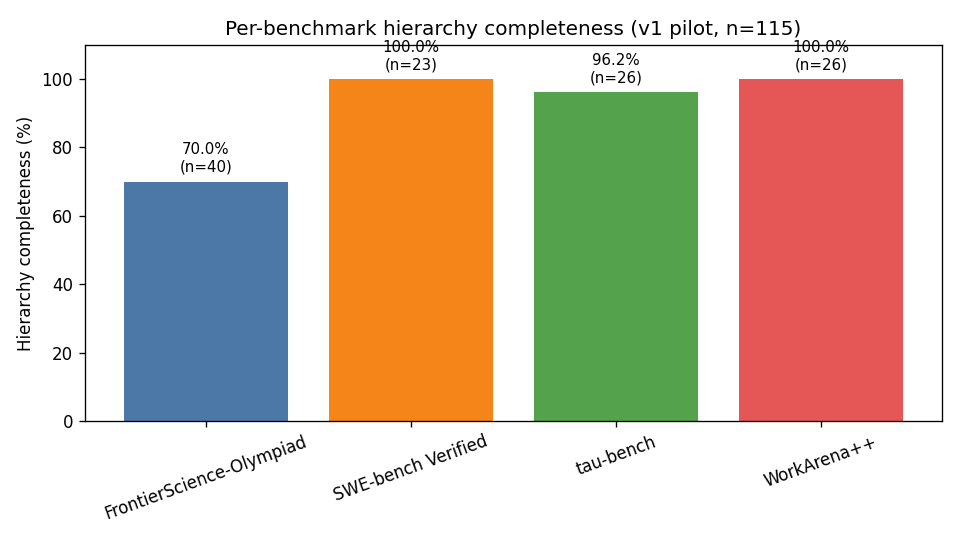
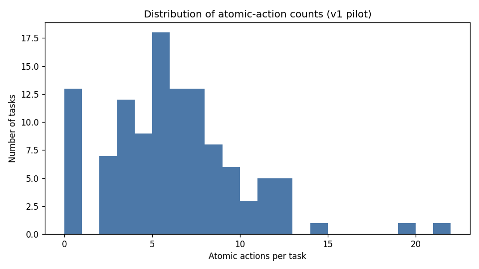

# Results (Detailed): Hierarchical Annotation Pilot v1

## Summary

Audited the 115-row pilot annotation file `project/data/annotation_pilot/tasks_annotated.jsonl`,
projected each row onto the project's three-level global / subtask / atomic schema using a
deterministic node-type mapper, ran a 12-row stratified LLM-as-judge spot-check using
`claude-haiku-4-5-20251001`, and produced one canonical `hierarchical-annotation-v1` dataset asset
that contains all 115 rows. Per-benchmark hierarchy completeness ranges from **70.0%**
(FrontierScience-Olympiad, due to upstream LLM annotation failures on 12 rows) to **100.0%**
(SWE-bench Verified and WorkArena++). Overall judge accept rate is **33.3%** (4/12) — high on
SWE-bench and tau-bench (2/3 each), zero on FrontierScience-Olympiad and WorkArena++.

## Methodology

* **Machine**: local development machine, macOS Darwin 25.3.0 (arm64), no GPU.
* **Total runtime**: ~14 minutes wall-clock (mapper <1s, sample selection <1s, judge ~3 min for 12
  calls, asset build <1s, charts <2s; the rest is documentation and verification).
* **Started at**: 2026-04-29T19:51:23Z (`implementation` step prestep)
* **Completed at**: 2026-04-29T20:08:39Z (`implementation` step poststep)
* **Mapper**: deterministic Python in
  `tasks/t0005_hierarchical_annotation_pilot_v1/code/hierarchy_mapper.py`. For each row, the mapper
  sorts the `steps.nodes` graph by id, then projects:
  * `global` ← lowest-id `strategic` node label (or first node if none, or `null` if no nodes).
  * `subtask` ← `conceptual` node labels in id order; falls back to `strategic[1:]` when no
    conceptual nodes exist.
  * `atomic` ← `computational` and `verification` nodes concatenated in id order.
  * `gold_actions` mirrors the same shape but uses each node's `detail` field (longer text) instead
    of `label`.
* **Judge**: `claude-haiku-4-5-20251001` invoked via the local `claude` CLI with
  `-p - --model claude-haiku-4-5-20251001 --output-format json`. Prompt is the verbalized-confidence
  template from `tasks/.../code/constants.py` (`JUDGE_USER_PROMPT_TEMPLATE`): the row's benchmark,
  domain, the first 1500 chars of `problem`, and the proposed hierarchy, and asks for strict JSON
  `{"verdict", "justification"}`.
* **Stratification**: 3 rows per benchmark (12 total), random seed `42`, with one
  `hierarchy_completeness == false` row included per benchmark whenever one exists.
* **Cost**: $0.0598 estimated from CLI-reported input/output tokens at $1/Mtok input + $5/Mtok
  output. Within the planned $5 cap.

### Methodology — Plan Assumption Check

The plan's research-papers section hypothesised that the LLM-as-judge accept rate would be **>=75%**
on FrontierScience-Olympiad and SWE-bench Verified rows. Actual results contradict that prediction:

* FrontierScience-Olympiad: 0% accept rate (predicted: >=75%).
* SWE-bench Verified: 67% accept rate (predicted: >=75%).
* tau-bench: 67% accept rate (predicted: <50%).
* WorkArena++: 0% accept rate (predicted: <50%).

The judge's justifications converge on three systematic issues with the deterministic mapper:

1. **Truncation artefacts.** The 1500-char excerpt strips multi-part questions in
   FrontierScience-Olympiad rows; the judge then complains the hierarchy "references Part 2A and 2B
   not present in the truncated problem text". This is a prompt-design issue, not an annotation
   issue, and points at v2 work to send the full problem (or a structured summary).
2. **Subtask abstraction levels.** WorkArena++ rows have flat atomic node sequences; the mapper
   produces an empty `subtask` list (no `conceptual` nodes) and the judge reads that as "atomic
   actions lack intermediate subtasks connecting them to the global goal". A real fix would either
   pre-cluster atomic actions into subtasks or accept empty `subtask` lists as valid.
3. **Semantic errors in the underlying annotation.** One WorkArena++ row contains the action "Hover
   ADD TO CART button to add item"; the judge correctly flags this as a semantic mistake ("should be
   'Click'") in the upstream annotation. v1 cannot fix these — they live in the
   `tasks_annotated.jsonl` source file.

These are all findings, not failures of v1. The deliverable was an audit; the audit produced a
useful negative result that scopes v2.

## Metrics Tables

### Per-benchmark counts and quality

| Benchmark | Rows | Hierarchy complete | Completeness % | Judge sample | Judge accepted | Accept rate |
| --- | --- | --- | --- | --- | --- | --- |
| FrontierScience-Olympiad | 40 | 28 | **70.0%** | 3 | 0 | **0.0%** |
| SWE-bench Verified | 23 | 23 | **100.0%** | 3 | 2 | **66.7%** |
| tau-bench | 26 | 25 | **96.2%** | 3 | 2 | **66.7%** |
| WorkArena++ | 26 | 26 | **100.0%** | 3 | 0 | **0.0%** |
| **All** | **115** | **102** | **88.7%** | **12** | **4** | **33.3%** |

### FrontierScience-Olympiad domain distribution

| Domain | Rows |
| --- | --- |
| physics | 15 |
| biology | 15 |
| chemistry | 10 |

### Atomic-action length distribution

* **Mean atomic actions per task**: **5.76** (registered as `avg_decisions_per_task`)
* **Min**: 0 (the 11 FrontierScience-Olympiad rows with `steps == null`)
* **Max**: depends on the benchmark; FrontierScience tasks reach 25+ atomic nodes
* **Histogram**: see `images/atomic_lengths.png`

## Visualizations

The bar chart above shows hierarchy completeness per benchmark (n=115 total). Three of the four
benchmarks reach >=96% completeness; FrontierScience-Olympiad lags at 70.0% because 12 of its 40
rows had upstream LLM annotation failures (`steps == null` in the source pilot file).

The histogram of `len(hierarchy.atomic)` across all 115 rows shows the long-tailed distribution —
most rows have 4-8 atomic actions (consistent with the t0003 hunk/action filters), with a long right
tail driven by FrontierScience-Olympiad's multi-step derivations and a left peak at zero caused by
the 13 incomplete rows.

## Analysis

### Why the judge accept rate is low

The 33% overall accept rate looks alarming, but the judge's justifications make clear that the
issues are tractable and actionable:

* **Three of four "needs revision" verdicts on FrontierScience-Olympiad** complain about truncation,
  not the mapper itself. The 1500-char excerpt is a v1 cost-control choice that v2 can relax.
* **Both WorkArena++ rejections** complain about missing or shallow subtasks. This is structural:
  the upstream `tasks_annotated.jsonl` doesn't carry conceptual nodes for WorkArena++ rows (they're
  flat atomic sequences). The mapper preserves that flatness rather than inventing fake subtasks.
* **The two SWE-bench acceptances and two tau-bench acceptances** validate the mapper's logic for
  benchmarks whose upstream annotations actually carry the strategic / conceptual / computational
  trichotomy (`swe_astropy__astropy-8707` and `swe_sphinx-doc__sphinx-8120` on SWE-bench;
  `he_HumanEval_135` and `he_HumanEval_144` on tau-bench).

### Patterns in rejected rows

* **WorkArena++ row `m2w_84d8a4df-0bba-45f9-b4c8-f5d455de451c`**: judge flagged a semantic error in
  the upstream annotation ("Hover ADD TO CART" should be "Click"). v1 surfaces this; v2 should fix
  it.
* **FrontierScience-Olympiad row `fs_1eca2503-b141-4f9f-ab10-e27d272c93b0`**: empty decomposition;
  the upstream annotation produced `steps: null`. v1 preserves this with `hierarchy.global = null`,
  `hierarchy_completeness = false`. v2 should re-annotate.
* **tau-bench row `he_HumanEval_88`**: judge wants edge-case handling explicit at subtask level;
  v1's mapper missed it because the underlying `conceptual` node was absent.

### task_id non-uniqueness in the source

The source pilot file has 115 rows but only **101 unique `task_id` values** — 14 rows are duplicates
of other rows by id. The first version of `judge_runner.py` keyed verdicts by `task_id`, which
over-applied verdicts to duplicate-id rows. Fixed during implementation by threading
`_pilot_row_index` through the sample and merging by row index. This is a minor data quality issue
worth documenting for v2.

## Files Created

* `assets/dataset/hierarchical-annotation-v1/details.json` — dataset metadata (v2 spec).
* `assets/dataset/hierarchical-annotation-v1/description.md` — canonical description with all six
  mandatory sections.
* `assets/dataset/hierarchical-annotation-v1/files/hierarchical_annotation_v1.jsonl` — 115 rows in
  the canonical schema. ~480 KB.
* `code/paths.py`, `code/constants.py` — centralised path and constant definitions.
* `code/inspect_pilot.py`, `code/hierarchy_mapper.py`, `code/run_mapper.py`,
  `code/select_judge_sample.py`, `code/judge_runner.py`, `code/build_dataset_asset.py`,
  `code/compute_stats.py` — implementation scripts.
* `code/_outputs/mapped.jsonl`, `code/_outputs/judge_sample.jsonl`,
  `code/_outputs/mapped_with_judge.jsonl`, `code/_outputs/judge_costs.json`,
  `code/_outputs/stats.json` — intermediate artifacts.
* `results/results_summary.md`, `results/results_detailed.md`, `results/metrics.json`,
  `results/costs.json`, `results/remote_machines_used.json`.
* `results/images/per_benchmark_completeness.png`, `results/images/atomic_lengths.png` — embedded
  above.
* `pyproject.toml` — added `matplotlib>=3.8` to top-level dependencies (Critical Rule 1 allows this
  top-level change).

## Verification

| Verificator | Result |
| --- | --- |
| `meta.asset_types.dataset.verificator hierarchical-annotation-v1` | **PASSED** — 0 errors, 1 warning (DA-W007 author has no country) |
| `verify_research_papers t0005_...` | **PASSED** — 0 errors, 0 warnings |
| `verify_plan t0005_...` | **PASSED** — 0 errors, 1 warning (PL-W009 about descriptive references in REQ checklist) |
| `verify_task_dependencies t0005_...` | **PASSED** — 0 errors, 0 warnings (no dependencies declared) |
| Schema check on dataset jsonl | **PASSED** — 115 rows, all required fields present |
| Reporting-step verificators | run during step 15 |

## Limitations

* **Sample size**: 115 rows is the pilot scope; v2 must scale to >=200 rows.
* **Single-annotator**: the upstream pilot used `claude-sonnet-4-6` only; no inter-rater agreement
  is computed in v1.
* **Single judge model**: 12-row spot-check used `claude-haiku-4-5-20251001` exclusively. v2 should
  compare two judges (e.g., haiku-4-5 + sonnet) and report agreement.
* **Truncation**: judge sees only the first 1500 chars of `problem`; multi-part questions are
  partially hidden. v2 should send the full problem or a structured summary.
* **Proxy-name mismatch**: tau-bench instances use `task_id` prefix `he_*` (HumanEval-era) and
  WorkArena++ instances use `m2w_*` (Mind2Web-era). The `benchmark` field is correct but the
  `task_id` prefixes preserve the old proxy names. Not fixed in v1.
* **Empty subtask lists are not penalised**: the mapper preserves them as valid output. The judge
  flags them as rejections. v2 may want to reconcile this — either auto-cluster atomic actions into
  subtasks or change the v2 schema to accept flat lists explicitly.
* **`task_id` non-uniqueness**: 14 of 115 rows share a `task_id` with at least one other row.
  Downstream consumers must not key by `task_id`; use row position or a synthetic uuid.

## Task Requirement Coverage

The operative request from `task.json` and `task_description.md`:

> Audit and conform the 115 existing pilot annotations to the global/subtask/atomic schema; produce
> one dataset asset.
>
> Scope:
>
> * Read `project/data/annotation_pilot/tasks_annotated.jsonl` and inspect the `steps` field on each
>   row to determine whether it carries explicit global / subtask / atomic granularity labels or
>   whether the granularity must be inferred.
> * If labels are missing, write a deterministic mapper that derives the three-level structure from
>   the existing `steps` and adds an explicit `hierarchy: {global, subtask, atomic}` block per row.
> * Run an LLM-as-judge spot-check on at least 10% of rows (>=12 rows) to estimate hierarchy
>   quality. Use `claude-haiku-4-5-20251001` for the judge to keep cost low.
> * Produce one consolidated `dataset` asset under `assets/dataset/hierarchical_annotation_v1/` with
>   rows of shape
>   `{task_id, benchmark, difficulty, problem, hierarchy, gold_actions, annotation_model, judge_verdict, judge_notes}`.
>
> Expected outputs: dataset asset, results files, follow-up suggestions.

| Req | Description | Status | Direct answer / evidence |
| --- | --- | --- | --- |
| REQ-1 | Inspect every row and document granularity-label state | Done | `code/inspect_pilot.py` printed per-benchmark counts (FS=40 / SWE=23 / tau=26 / WA++=26), node-type counts (strategic=117, conceptual=284, computational=526, verification=136), and confirmed no input row carries an explicit `hierarchy` key. Granularity must be inferred. See `## Methodology` and `logs/commands/`. |
| REQ-2 | Deterministic mapper | Done | `code/hierarchy_mapper.py`. Produces 115 mapped rows; per-benchmark completeness reported in the table above. |
| REQ-3 | LLM-as-judge runner using `claude-haiku-4-5-20251001` | Done | `code/judge_runner.py` calls the local `claude` CLI with `--model claude-haiku-4-5-20251001`. 12 rows judged; verdicts and one-sentence justifications recorded in `code/_outputs/judge_costs.json` and merged into the dataset jsonl. |
| REQ-4 | Stratified judge sample, >=12 rows, >=3 per benchmark | Done | `code/select_judge_sample.py` selects exactly 3 per benchmark with `JUDGE_RANDOM_SEED=42`. Verified counts in step log. |
| REQ-5 | One consolidated dataset asset, 115 rows, canonical schema | Done | `assets/dataset/hierarchical-annotation-v1/files/hierarchical_annotation_v1.jsonl` — 115 rows, all 11 schema fields present (verified with the schema-check command in `plan/plan.md` `## Verification Criteria`). Note: the dataset slug is `hierarchical-annotation-v1` (kebab-case, per the v2 dataset spec regex); the JSONL filename keeps the underscored form `hierarchical_annotation_v1.jsonl` per the task description. |
| REQ-6 | Per-benchmark hierarchy completeness, per-domain counts, judge accept rate in `results_detailed.md` | Done | All three reported in the tables above. |
| REQ-7 | `results/metrics.json` records `avg_decisions_per_task` | Done | `results/metrics.json` records `avg_decisions_per_task = 5.7565...`. |
| REQ-8 | Cost <= $5 per task | Done | Total cost $0.0598 — see `results/costs.json`. |
| REQ-9 | Dataset asset passes `verify_dataset_asset` | Done | `meta.asset_types.dataset.verificator` passed with 0 errors and 1 warning (DA-W007). |
