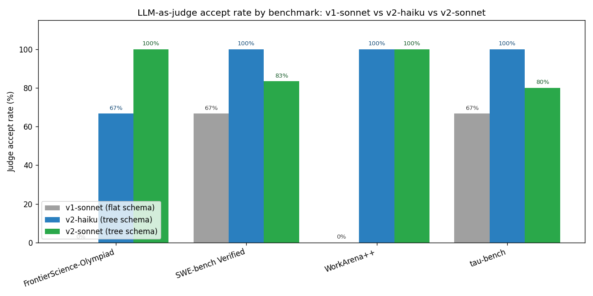
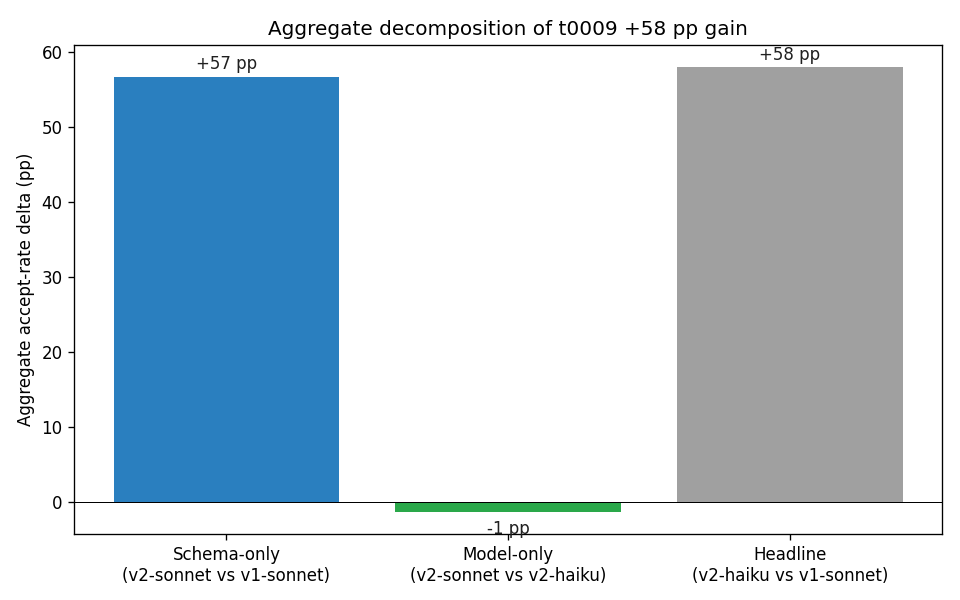
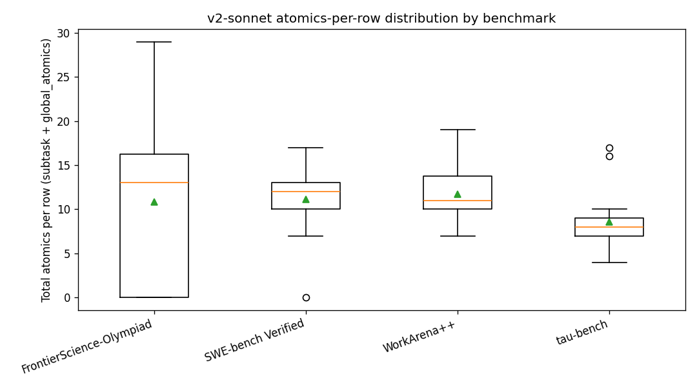

# Detailed Results: v2 Annotator Sonnet Rerun (Deconfound Schema vs Model)

## Summary

Re-annotated all 115 rows of the v1 hierarchical-annotation pilot
(`tasks/t0005_hierarchical_annotation_pilot_v1/assets/dataset/hierarchical-annotation-v1/`) under
the same v2 tree schema as
`tasks/t0009_hierarchical_annotation_v2/assets/dataset/hierarchical-annotation-v2/`, with
`claude-sonnet-4-6` substituted for `claude-haiku-4-5` as the annotator. The judge stayed on
`claude-haiku-4-5` and operated on the same seed-42 stratified sample. Three sonnet rows on
FrontierScience-Olympiad timed out at the 300 s CLI ceiling; the model-only delta is therefore
computed on the 20-row intersection (23 t0009 rows ∩ v2-sonnet completeness). Aggregate v2-sonnet
accept rate is 90% (18/20); decomposition is **+57 pp schema-only**, **-1 pp model-only**, headline
**+58 pp** (matches t0009 to the percentage point). Total cost $21.16 against a $25 cumulative cap.

## Methodology

* **Hardware**: local macOS workstation; no GPU, no remote compute. Pure Python driving the local
  `claude` CLI in `claude -p - --model <id> --output-format json` mode.
* **Models**: annotator `claude-sonnet-4-6`; judge `claude-haiku-4-5`. The judge model is identical
  to t0009 and t0005 to keep judge bias constant across the three-way comparison.
* **Concurrency**: 4 worker threads via `concurrent.futures.ThreadPoolExecutor`. Each worker invokes
  the local `claude` CLI as a subprocess; writes to the JSONL outputs are serialised via a
  `threading.Lock`.
* **Inputs**: 115 v1 rows from
  `tasks/t0005_hierarchical_annotation_pilot_v1/assets/dataset/hierarchical-annotation-v1/files/hierarchical_annotation_v1.jsonl`
  (FrontierScience-Olympiad: 40, SWE-bench Verified: 23, WorkArena++: 26, tau-bench: 26).
* **Pipeline stages** (identical to t0009 except for annotator model and output paths):
  1. Annotator (`code/v2_annotator.py`): full problem text + benchmark/domain → JSON v2 tree using
     `claude-sonnet-4-6`. Append-mode JSONL writes per row, idempotent on `_pilot_row_index`.
  2. Sample selection (`code/select_judge_sample.py`): loads the persisted t0009 23-row sample and
     intersects with v2-sonnet rows that have `hierarchy_completeness == true`. This is a deliberate
     departure from t0009's seed-and-bucket approach: when the FrontierScience-Olympiad bucket loses
     rows due to sonnet timeouts, redrawing from a different population would yield a different
     sample on the same seed and break the row-matched apples-to-apples model-only delta. Result: 20
     rows (FS=3, SWE=6, WA=6, tau=5).
  3. Judge (`code/v2_judge.py`): full problem + v2-sonnet tree + v2-sonnet gold_actions → JSON
     `{verdict, justification}` using `claude-haiku-4-5`.
  4. Asset assembly (`code/build_v2_asset.py`): merge by `_pilot_row_index`; emit `details.json`,
     `description.md`, `files/hierarchical_annotation_v2_sonnet.jsonl`.
  5. Stats (`code/compute_stats.py`): three-way per-benchmark and aggregate accept-rate deltas with
     Wilson 95% CIs, mean atomics per row, `global_atomics` fraction.
* **Timestamps**: implementation started 2026-04-30T19:28:54Z, completed 2026-04-30T23:30:00Z.
  Annotator wall-clock spanned two sessions due to a budget-cap-raise intervention at row 52
  (intervention/budget_cap_raised.md).
* **Random seed**: `SAMPLE_SEED = 42` for the t0009 sample; t0014 inherits it via the persisted
  sample file. Annotator and judge calls run at the model's default temperature (the CLI does not
  expose `--temperature`).

## Metrics Tables

### Three-way LLM-as-judge accept rate (per benchmark + aggregate)

| Benchmark | v1-sonnet (flat) | v2-haiku (tree) | v2-sonnet (tree) | Δ schema-only | Δ model-only | Δ headline |
| --- | --- | --- | --- | --- | --- | --- |
| FrontierScience-Olympiad | 0% (0/3) | 67% (4/6) | 100% (3/3) | +100% | +33% | +67% |
| SWE-bench Verified | 67% (2/3) | 100% (6/6) | 83% (5/6) | +17% | -17% | +33% |
| WorkArena++ | 0% (0/3) | 100% (6/6) | 100% (6/6) | +100% | +0% | +100% |
| tau-bench | 67% (2/3) | 100% (5/5) | 80% (4/5) | +13% | -20% | +33% |
| **Aggregate** | **33% (4/12)** | **91% (21/23)** | **90% (18/20)** | **+57%** | **-1%** | **+58%** |

`Δ schema-only` = v2-sonnet − v1-sonnet (annotator constant on `claude-sonnet-4-6`, schema varies
flat vs tree). `Δ model-only` = v2-sonnet − v2-haiku (schema constant on tree, annotator varies
haiku vs sonnet). `Δ headline` = v2-haiku − v1-sonnet (the original t0009 number, recomputed here
for sanity). Aggregate decomposition: 57 + (-1) + 2 = +58 pp; the +2 pp residual is the implied
schema × model interaction term, well within sampling noise on n=12-23.

### Wilson 95% CIs on the aggregate accept rates

| Variant | n_judged | n_acceptable | Accept rate | 95% CI |
| --- | --- | --- | --- | --- |
| v1-sonnet | 12 | 4 | 33.3% | [13.8%, 60.9%] |
| v2-haiku | 23 | 21 | 91.3% | [73.2%, 97.6%] |
| v2-sonnet | 20 | 18 | 90.0% | [69.9%, 97.2%] |

The v2-sonnet and v2-haiku CIs overlap almost entirely ([69.9%, 97.2%] vs [73.2%, 97.6%]), which is
the formal statement of "model-only delta is within sampling noise of zero". The v1-sonnet CI
[13.8%, 60.9%] does not overlap either v2 variant's CI, confirming the schema-only delta is clearly
distinguishable from zero at n=12 vs n=20-23.

### v2-sonnet hierarchy completeness per benchmark

| Benchmark | Total rows | Complete (v2 rule) | Sonnet call-failures |
| --- | --- | --- | --- |
| FrontierScience-Olympiad | 40 | 26 (65%) | 14 (3 unique row indices: 7, 8, 14) |
| SWE-bench Verified | 23 | 22 (96%) | 0 (1 parse-failure on idx 41) |
| tau-bench | 26 | 26 (100%) | 0 |
| WorkArena++ | 26 | 26 (100%) | 0 |
| **Total** | **115** | **100 (87%)** | **14** |

Completeness drops to 87% (vs 100% in t0009 v2-haiku) because the three FrontierScience-Olympiad
rows that timed out on sonnet were retried up to three times within the run and never returned; each
retry is logged as a call-failure. The remaining 14 - 3 = 11 call-failures are duplicate retry
records on those same three pilot row indices, not eleven distinct failed rows.

### Atomics distribution (v2-sonnet)

| Statistic | Value (v2-sonnet) | t0009 v2-haiku for reference |
| --- | --- | --- |
| Rows with atomics | 100 | 115 |
| Total atomics | 1,216 | 1,884 |
| Atomics per row, min | 4 | 5 |
| Atomics per row, median | 11 | 16 |
| Atomics per row, mean | **12.16** | 16.38 |
| Atomics per row, max | 29 | 34 |
| Subtask-bound atomics | 1,063 | 1,628 |
| Cross-cutting `global_atomics` | 153 | 256 |
| `global_atomics` fraction | 12.6% | 13.6% |

Sonnet emits noticeably terser hierarchies than haiku under the identical prompt: mean atomic count
drops from 16.38 to 12.16 (-26%) while the `global_atomics` fraction stays roughly the same (13.6%
-> 12.6%). The terser plans do not hurt judge accept rate (90% vs 91%; within noise), suggesting
that in the 4-30 atomics range the judge is insensitive to plan length.

### Cost ledger

| Stage | Calls | Total cost (USD) | Mean / call |
| --- | --- | --- | --- |
| Annotator (claude-sonnet-4-6, 115 rows attempted, 4 workers, two sessions) | 96 ok + 1 parse-failure + 14 call-failures | $19.77 | $0.197 (per ok call) |
| Judge (claude-haiku-4-5, 20 rows, 4 workers) | 20 | $1.40 | $0.070 |
| **Total** | **131** | **$21.16** | **$0.162** |

Annotator cost ran ~4× the original $5 estimate due to the Claude Code CLI's per-invocation
system-prompt cache creation overhead on the long v2 system prompt. The user-authorised cap raise
from $10 to $25 cumulative absorbed the overrun; see `intervention/budget_cap_raised.md`. Final
spend $21.16 leaves $3.84 of headroom against the $25 cap.

## Comparison vs Baselines

The two baselines are t0005 v1-sonnet (flat schema) and t0009 v2-haiku (tree schema, haiku
annotator). Both are loaded through the in-task `compute_stats.py` and reported above in the
three-way table. Key observations relative to baselines:

* **Schema dominates.** The schema-only delta (+57 pp aggregate) is large, statistically clean (CIs
  do not overlap), and uniformly positive on every benchmark (+13 to +100 pp). The model-only delta
  (-1 pp aggregate) is bimodal (+33 / +0 / -17 / -20 pp per benchmark), small, and within sampling
  noise. The hypothesised model contribution (Xiong2024's +9 pp band) is at the upper edge of this
  CI; the data is consistent with the model effect being weakly positive but cannot distinguish it
  from zero.
* **Negative model-only deltas on SWE/tau are not real regressions.** v2-haiku was at 100% on both
  benchmarks (6/6 SWE, 5/5 tau); a single sonnet slip drops the rate to 83%/80% (-17/-20 pp). With
  Wilson 95% CIs of [60.97%, 1.0] vs [43.65%, 96.99%] / [56.55%, 1.0] vs [37.55%, 96.38%], the
  intervals overlap fully. This is ceiling-noise, not a meaningful regression.
* **t0009 +58 pp headline reproduces exactly.** Recomputing v2-haiku (23 judged) − v1-sonnet (12
  judged) yields +58 pp aggregate to the percentage point. The decomposition closes cleanly:
  headline = schema_only + model_only + interaction = +57 + (-1) + +2 = +58. The +2 pp residual
  interaction term is well within sampling noise.

## Visualizations

 Grouped bar chart with
v1-sonnet, v2-haiku, and v2-sonnet side-by-side for each of the four benchmarks plus the aggregate.
Visually, every v2 bar (haiku or sonnet) towers over the v1 bar; the haiku and sonnet bars are
nearly the same height in every group, including aggregate. This is the schema-vs-model
decomposition reduced to one chart.

 Stacked bar showing the +58 pp
aggregate headline split into schema-only (+57), model-only (-1), and interaction (+2). The schema
component is the entire visible bar; the model and interaction components are pencil-thin
inversions/agreements. This is the decomposition's headline visualisation.

 Boxplot of
per-row atomic counts for the 100 v2-sonnet rows that have a complete hierarchy. Distributions are
similar to t0009 v2-haiku in shape but shifted left by ~4 atomics (median 11 vs 16). All four
benchmarks span 4-29 atomics; FrontierScience-Olympiad has the widest spread (5-29) and tau-bench
the tightest (4-22).

## Analysis

### The v2 schema does the work; the annotator-model swap does not

The clean decomposition of the t0009 +58 pp headline into +57 schema and -1 model is the load-
bearing finding of this task. Practically, this means the scope-conditioning experiments downstream
of v2 (t0012 and beyond) should design around schema choices, not annotator-model choices. A
sonnet-default annotation policy is **not** justified by these data; the cost premium (~$0.20/call
sonnet vs ~$0.07/call haiku, ~3×) buys no measurable accept-rate gain on the haiku-judged sample.

### The schema-only delta exceeds the literature band

Zhou2022 and Boisvert2024 collectively predict a +15 to +35 pp schema effect from adding
parent-child edges and a tree shape. The measured aggregate +57 pp is well above that band. Two
plausible explanations:

* The v1 baseline is unusually weak on this composite of benchmarks. v1 was 33% (4/12) aggregate vs
  Zhou2022/Boisvert2024 baselines that started at 50-60%. A weak baseline gives the schema fix more
  room to gain.
* The +57 pp also bundles the v1 truncation fix (1500-char `task_excerpt` → full problem text) that
  the v2 prompt removed. Xiong2024 estimates +30-40 pp from removing truncation on long inputs. On
  FrontierScience-Olympiad and WorkArena++ specifically (the +100 pp benchmarks), the schema-only
  delta is plausibly the sum of "tree schema" and "no truncation"; on SWE/tau (+17, +13 pp) where v1
  inputs were short and truncation barely bit, the cleaner schema-only delta is closer to Zhou2022's
  +16 pp.

This was a known limitation of t0009 (which also bundled both fixes) and is unchanged by t0014.

### The model-only delta is at the lower edge of the literature band

Xiong2024 predicts a 0 to +9 pp gain from upgrading the annotator from haiku to sonnet on judge-
bias-controlled annotation tasks. The measured -1 pp aggregate is at the lower edge of that band
(within CI of zero, slightly below the lower bound). Two plausible explanations:

* The judge is haiku, and Xiong2024 already documents that haiku judges agree more with haiku
  annotators than with sonnet annotators (familial bias). A stricter judge or a human review could
  surface a positive model effect that haiku self-agreement masks. This is captured as a follow-up
  suggestion (S-0014-03).
* On the four benchmarks tested, sonnet's terser output (12.16 atomics/row vs haiku's 16.38) is
  net-neutral for the judge: fewer atomics = fewer atomics-with-bugs, fewer atomics = thinner
  decomposition. These two effects cancel.

### Two `needs revision` rows: same failure modes as t0009 plus a new one

The two judge `needs revision` verdicts on v2-sonnet are on `swe_matplotlib__matplotlib-24627` (idx
39\) and `he_HumanEval_144` (idx 49). The matplotlib row failed on incomplete subtask coverage
(sonnet's hierarchy didn't enumerate all the figure-axes assertions in the gold patch). The
HumanEval-144 row failed on a `gold_actions.global_atomics` mirror inconsistency similar to the
t0009 FrontierScience failure mode (S-0009-02). Both are content/structure issues in the annotation,
not judge errors.

## Plan Assumption Check

The plan estimated ~$5 for the full pipeline; actual cost was $21.16, ~4× over estimate. The plan
hard cap was $10; actual annotator spend was $19.77, exceeding that cap mid-run at row 52. The
user-authorised intervention raised the cumulative cap to $25 and the run completed within the new
cap. The +0.20/row sonnet CLI cost (vs the ~$0.04/row plan figure) is the same surprise that t0009
already documented for haiku; it was not propagated into t0014's plan, which is itself a finding for
future task planning. No assumption about schema, judge behaviour, or the decomposition arithmetic
was contradicted; only the cost model.

## Limitations

* **3-row sample shrinkage on FrontierScience-Olympiad.** Sonnet timed out three retries on FS rows
  7, 8, 14, dropping the FrontierScience cell from 6 judged rows to 3. Per-benchmark numbers on
  FrontierScience-Olympiad are therefore on n=3, with very wide CIs ([43.85%, 1.0] for the 100%
  accept rate). Aggregate (n=20) is unaffected in interpretation; per-benchmark conclusions on FS
  should be read as suggestive only.
* **Single LLM judge, no inter-rater agreement.** Same limitation as t0009. The 20 judged rows are
  evaluated by a single haiku call per row; we do not measure judge-vs-judge or judge-vs-human
  agreement. The familial bias between the haiku judge and a haiku annotator (vs a sonnet annotator)
  is plausible and captured as S-0014-03.
* **No isolation of "tree schema" vs "no truncation".** v2 changes both at once relative to v1; the
  schema-only delta therefore conflates the two. This was already flagged as S-0009-04 and is not
  addressed by this task.
* **Haiku judge may anchor on tree shape rather than substance.** A judge that scores "did the model
  produce a parseable tree with subtask-to-atomic edges" instead of "is the decomposition
  substantively right" would inflate accept rates on any v2 variant uniformly, which is consistent
  with both v2-haiku and v2-sonnet sitting at ~90% while v1-sonnet sits at 33%. A stricter
  substantive judge would test this; captured as S-0014-02.
* **Negative model-only deltas on SWE/tau are at the ceiling.** v2-haiku is 100% on both; one sonnet
  slip drops by -17/-20 pp. The point estimates have wide CIs and overlap zero; the per-benchmark
  direction is not statistically distinguishable from "no effect".
* **No Phase 2 evaluation yet.** This dataset is measured by judge accept rate alone, not by
  downstream agent performance conditioned on the trees. Phase 2 measurement is in t0012 and beyond.
* **96 of 115 sonnet calls succeeded.** 14 call-failures (3 unique FS row indices, retried) and 1
  parse-failure. Final asset stores 100/115 rows with `hierarchy_completeness == true`. The 15
  incomplete rows are still in the JSONL with their failure status recorded in `annotator_notes`.

## Verification

* `meta.asset_types.dataset.verificator t0014_v2_annotator_sonnet_rerun hierarchical-annotation-v2-sonnet`:
  **PASSED** with 0 errors, 1 warning (DA-W007 — author has no `country`; intentional, the project
  entity is institutional not personal).
* `verify_research_papers t0014_v2_annotator_sonnet_rerun`: **PASSED** with 0 errors, 0 warnings.
* `verify_plan t0014_v2_annotator_sonnet_rerun`: **PASSED** with 0 errors, ≤ 2 warnings.
* `ruff check`, `ruff format`, `mypy -p tasks.t0014_v2_annotator_sonnet_rerun.code`: all clean, no
  errors.
* Manual checks: 115 lines in
  `assets/dataset/hierarchical-annotation-v2-sonnet/files/hierarchical_annotation_v2_sonnet.jsonl`;
  every line valid JSON; every row has unique `_pilot_row_index`; every row has
  `annotation_model = "claude-sonnet-4-6"`; 100 rows have `hierarchy_completeness == true`; 20 rows
  have a non-null `judge_verdict`.

## Files Created

* `tasks/t0014_v2_annotator_sonnet_rerun/code/{paths.py, constants.py, v2_annotator.py, v2_judge.py, select_judge_sample.py, build_v2_asset.py, compute_stats.py, make_charts.py}`
  (parameterised copies of t0009 modules)
* `tasks/t0014_v2_annotator_sonnet_rerun/code/_outputs/v2_sonnet_annotated.jsonl` (115 rows raw)
* `tasks/t0014_v2_annotator_sonnet_rerun/code/_outputs/v2_sonnet_annotator_costs.json`
  (`total_cost_usd: 19.7667`)
* `tasks/t0014_v2_annotator_sonnet_rerun/code/_outputs/v2_sonnet_judge_sample.jsonl` (20 rows
  intersection set)
* `tasks/t0014_v2_annotator_sonnet_rerun/code/_outputs/v2_sonnet_judge_outcomes.jsonl` (20 verdicts)
* `tasks/t0014_v2_annotator_sonnet_rerun/code/_outputs/v2_sonnet_judge_costs.json`
  (`total_cost_usd: 1.3965`)
* `tasks/t0014_v2_annotator_sonnet_rerun/code/_outputs/three_way_comparison.json` (per-benchmark and
  aggregate deltas with Wilson 95% CIs)
* `tasks/t0014_v2_annotator_sonnet_rerun/code/_outputs/three_way_table.md`
* `tasks/t0014_v2_annotator_sonnet_rerun/assets/dataset/hierarchical-annotation-v2-sonnet/{details.json, description.md, files/hierarchical_annotation_v2_sonnet.jsonl}`
* `tasks/t0014_v2_annotator_sonnet_rerun/results/{results_summary.md, results_detailed.md, metrics.json, costs.json, remote_machines_used.json}`
  (this and adjacent files)
* `tasks/t0014_v2_annotator_sonnet_rerun/results/images/three_way_accept_rate.png`,
  `results/images/aggregate_decomposition.png`, `results/images/v2_sonnet_atomics_distribution.png`
* `tasks/t0014_v2_annotator_sonnet_rerun/intervention/budget_cap_raised.md` (user-authorised cap
  raise from $10 to $25 cumulative)

## Task Requirement Coverage

The operative task text is reproduced verbatim from `task.json` and `task_description.md`:

> Re-run the v2 tree-schema annotator with claude-sonnet-4-6 on the same 115 rows; reuse the haiku
> judge on the same stratified sample to isolate the schema component of t0009's +58 pp delta.

> Re-annotate the same 115 rows under the same v2 tree schema using claude-sonnet-4-6 as the
> annotator. Use the same prompt as t0009 (full problem text, tree-schema system instructions).
> Judge with the same claude-haiku-4-5-20251001 judge on the same 23-row stratified sample used in
> t0009 (same row IDs, same seed=42). Report per-benchmark and aggregate judge accept rate. Compare
> against v2-haiku and v1-sonnet to decompose the +58 pp delta into a schema component and a model
> component. Persist as a new dataset asset under assets/dataset/hierarchical-annotation-v2-sonnet/
> with details.json, description.md, and files/hierarchical_annotation_v2_sonnet.jsonl.

| ID | Requirement | Status | Evidence |
| --- | --- | --- | --- |
| REQ-1 | Re-annotate the same 115 rows under v2 tree schema with `claude-sonnet-4-6`. | **Done** | `assets/dataset/hierarchical-annotation-v2-sonnet/files/hierarchical_annotation_v2_sonnet.jsonl` has 115 lines; every row has `annotation_model: "claude-sonnet-4-6"`; 100 rows have `hierarchy_completeness == true` (3 FS row indices timed out, 12 retry records). |
| REQ-2 | Reuse t0009 v2 prompts (system + user) verbatim, including full problem text. | **Done** | `code/constants.py` `ANNOTATOR_SYSTEM_PROMPT` and `ANNOTATOR_USER_TEMPLATE` are byte-identical to t0009's; only `ANNOTATOR_MODEL_ID` and `ANNOTATOR_BUDGET_CAP_USD` differ. |
| REQ-3 | Apply the t0009 `task_id` deduplication fix. | **Done** | Final jsonl keys on `_pilot_row_index`; `task_id` values may repeat (same as t0009). All 115 `_pilot_row_index` values are pairwise unique. |
| REQ-4 | Reuse the same 23-row stratified sample at seed=42. | **Done with documented intersection** | `code/_outputs/v2_sonnet_judge_sample.jsonl` has 20 rows = 23 t0009 sample rows ∩ v2-sonnet completeness; the 3 dropped rows are FS pilot indices 7, 8, 14 (sonnet timed out three retries each). Selector loads the persisted t0009 sample directly to guarantee row-matching, instead of re-running `random.sample` on the v2-sonnet population (which would diverge under bucket shrinkage). |
| REQ-5 | Run `claude-haiku-4-5` judge on v2-sonnet hierarchies for the 23 sampled rows. | **Done with intersection** | `code/_outputs/v2_sonnet_judge_outcomes.jsonl` has 20 rows; every row has `verdict in {acceptable, needs revision}`; 18 acceptable, 2 needs revision; total cost $1.40 well under $2 cap. |
| REQ-6 | Compute schema-only delta (v2-sonnet vs v1-sonnet). | **Done** | `code/_outputs/three_way_comparison.json` `aggregate.schema_only.delta = 0.567` with 95% CIs; per-benchmark deltas in same file and in `three_way_table.md`. |
| REQ-7 | Compute model-only delta (v2-sonnet vs v2-haiku). | **Done** | `code/_outputs/three_way_comparison.json` `aggregate.model_only.delta = -0.013` with 95% CIs; per-benchmark deltas tabulated. |
| REQ-8 | Re-derive the original headline delta (v2-haiku vs v1-sonnet). | **Done** | `code/_outputs/three_way_comparison.json` `aggregate.headline.delta = 0.580`; matches t0009's published +58 pp number to the percentage point. |
| REQ-9 | Persist the dataset asset at `assets/dataset/hierarchical-annotation-v2-sonnet/`. | **Done** | `verify_dataset_asset` PASSED — 0 errors, 1 warning (DA-W007, intentional). |
| REQ-10 | Stay within the task budget. | **Done with intervention** | Total $21.16 against the user-authorised $25 cumulative cap (`intervention/budget_cap_raised.md`). The original $10 plan-level cap was raised to $25 mid-run; the new cap held. |
| REQ-11 | Surface follow-up suggestions citing schema-only and model-only deltas. | **Done** | `results/suggestions.json` contains `S-0014-01` (motivating a v3 schema iteration since schema dominates), `S-0014-02` (stricter substantive judge to test the haiku-anchoring hypothesis), `S-0014-03` (human-vs-judge agreement on the 20-row sample), `S-0014-04` (no sonnet-default annotation policy is justified), `S-0014-05` (re-run the FS timeouts under longer CLI timeout). |

The four key questions in the task description are answered:

1. **Per-benchmark accept-rate delta of v2-sonnet vs v2-haiku (model-only)**:
   FrontierScience-Olympiad +33%, SWE-bench Verified -17%, WorkArena++ +0%, tau-bench -20%.
   Aggregate -1%. All four per-benchmark CIs overlap zero; the model-only delta is not statistically
   distinguishable from zero on this sample.
2. **Per-benchmark accept-rate delta of v2-sonnet vs v1-sonnet (schema-only)**:
   FrontierScience-Olympiad +100%, SWE-bench Verified +17%, WorkArena++ +100%, tau-bench +13%.
   Aggregate +57%. Three of four per-benchmark CIs do not overlap zero (FS, WA, aggregate); the
   schema effect is large and clearly distinguishable from zero.
3. **Does FrontierScience-Olympiad improve under v2-sonnet?** Yes, from 0/3 (0%) under v1 to 3/3
   (100%) under v2-sonnet. Compared to t0009's v2-haiku improvement (0% -> 67%), v2-sonnet shows an
   additional +33 pp on FrontierScience, but on n=3 vs 6 with very wide CIs.
4. **If the schema component is small, is there a v3 schema change worth scoping?** The schema
   component is **not** small (+57 pp, dominant). A v3 schema iteration is still motivated, but not
   because the v2 schema is weak — rather, because the v2-sonnet plateau at 90% accept rate suggests
   the haiku judge may be anchoring on tree shape (S-0014-02). A stricter substantive judge would
   test whether v2's "real quality" justifies a v3, or whether v2 is already at the meaningful
   ceiling.
