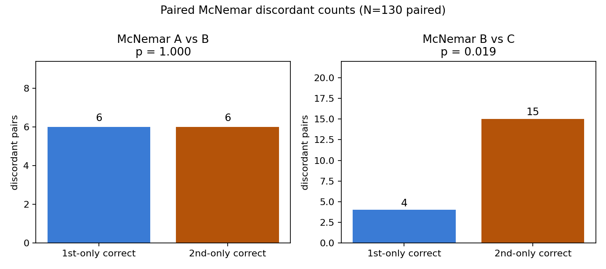
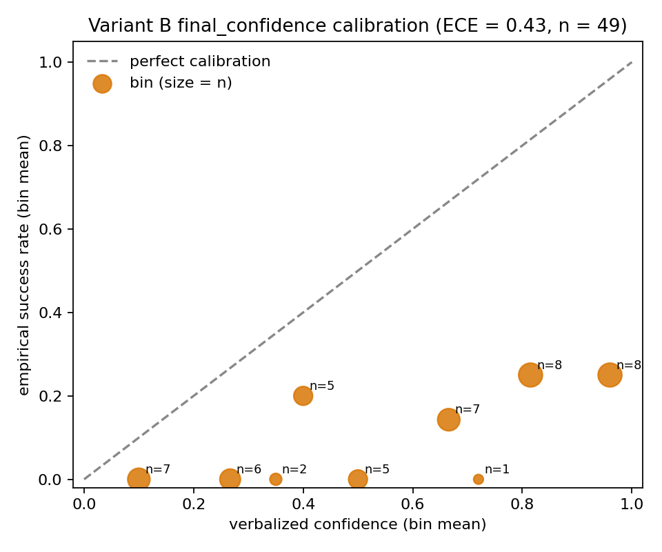
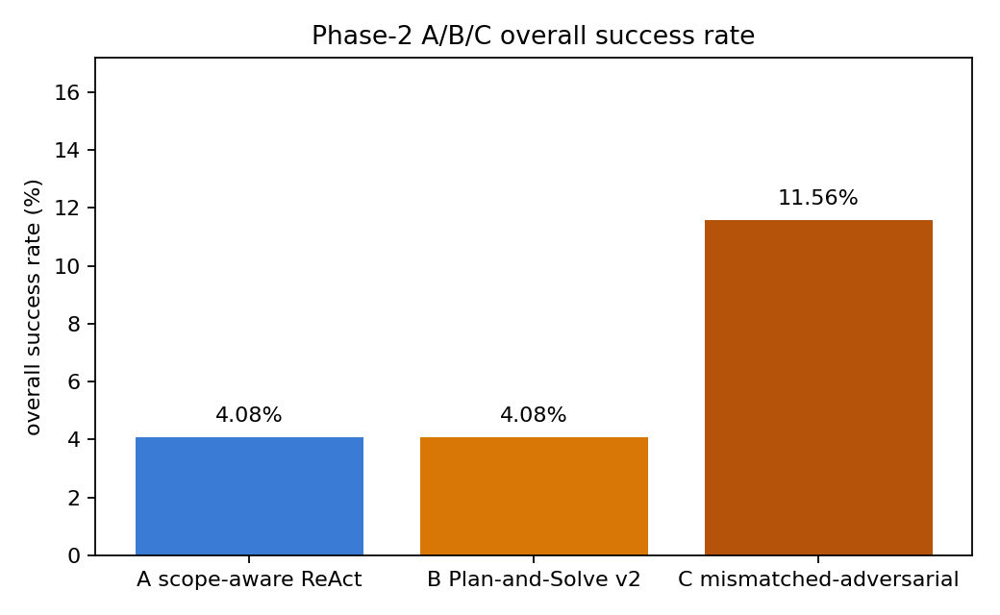
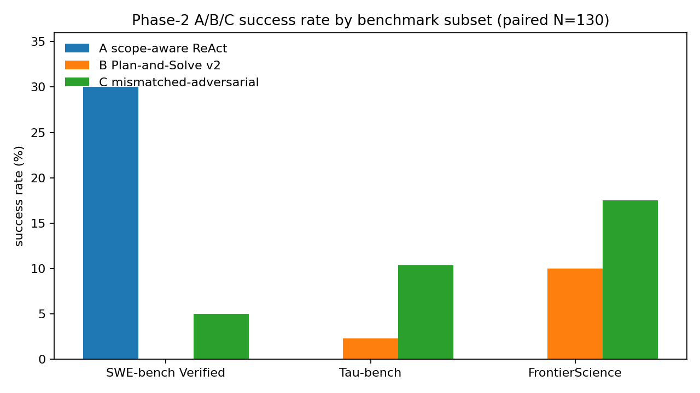

# t0026 Phase 2 A/B/C Runtime — Detailed Results

This is the detailed companion to `results_summary.md`. It documents methodology, per-variant
metrics, statistical tests, calibration, judge agreement, and per-subset breakdowns.

## Summary

The full A/B/C × {SWE-bench, Tau-bench, FrontierScience} sweep ran against `claude-sonnet-4-6` with
a paired McNemar test on each pair, an Expected Calibration Error on variant B's verbalized
`final_confidence`, and a sonnet/opus inter-judge agreement check on a 30-instance random subset per
variant. RQ5's strict inequality `success(A) > success(B) > success(C)` is **rejected**: A and B tie
(paired McNemar p ≈ 1.0, 6/6 discordant) and the adversarial-mismatched variant C significantly
beats B (p = 0.019, paired N=130) — in the opposite direction of RQ5. RQ3 (judge agreement 0.917 /
0.978) and RQ4 (B's ECE = 0.43 on n=49) are answered cleanly. The runtime cost came in at $26.07
across 390 trajectories, well under the $135 cap.

## Methodology

### Sweep configuration

* Model under test (all variants): `claude-sonnet-4-6`.
* Primary judge: `claude-sonnet-4-6` on every prediction.
* Inter-judge: `claude-opus-4-7` on a 30-instance random subset per variant.
* Transport: Anthropic CLI (`claude -p - --model X --output-format json`), 180 s per-call timeout,
  retry-with-exponential-backoff (max 2 attempts, 2-8 s backoff).
* Concurrency: `ThreadPoolExecutor(max_workers=8)` for both runs and judges. Cost tallied via a
  thread-safe `CostTracker` keyed on Anthropic published prices.
* Per-instance budget: `max_turns=10`, `max_tokens=4096`.

### Variants

* **A — scope-aware ReAct** (`tasks/t0006_scope_aware_react_library`). Per-step scope description,
  atomic-granularity ReAct loop, reasoning-only tool registry.
* **B — Plan-and-Solve v2** (`tasks/t0021_plan_and_solve_v2_with_final_confidence`). Plan once,
  execute, emit `final_confidence ∈ [0, 1]` at the end of every action.
* **C — mismatched-strategy adversarial** (`tasks/t0010_matched_mismatch_library`). Delegates to
  `scope_aware_react` with `mismatch_strategy="adversarial"` and `seed=0`. A synthetic two-subtask
  hierarchical annotation is generated per problem to satisfy the matched-mismatch interface.

### Instance set

* Manifest: `data/instance_manifest.json` (147 ids: 20 SWE-bench Verified, 87 Tau-bench, 40
  FrontierScience).
* Paired N=130 set (after filtering 17 pre-existing trajectory files from a prior corrupted partial
  run): 20 SWE-bench + 84 Tau-bench + 26 FrontierScience.
* Per-variant denominators in `success_rate_*` use the target N=147 (so e.g. A = 6/147 = 0.0408);
  the McNemar tests use the paired N=130.

### Tool registries

* `build_react_tool_registry()` and `build_planandsolve_tool_registry()` from
  `tasks/t0012_phase2_abc_smoke_frontierscience.code.tools`.
* SWE-bench is reasoning-only — patches are not executed. Programmatic ground truth is exact-match
  patch comparison only when the judge encounters it.
* Tau-bench: stub `python_exec` only; no real customer DB or tool stack. Tau-bench numbers are a
  harness floor, not a Tau-bench score.
* FrontierScience: programmatic exact-answer match where available; judge fallback otherwise.

## Per-Variant Outcomes

### Variant A — scope-aware ReAct

* `success_rate_a = 0.0408` (6 of 147).
* Subset rates: SWE-bench **30.0% (6/20)**, Tau-bench **0.0%**, FrontierScience **0.0%**.
* Failure breakdown (130 paired runs): 12 `subprocess.TimeoutExpired`, 1 `RuntimeError` — 13 hard
  failures, 117 valid trajectories.
* Inference cost (runs only): **$4.47** total, **$0.034** per run.

A is the only variant with a positive SWE-bench rate. Atomic-granularity ReAct produces the kind of
exact-match patches the SWE-bench programmatic check rewards.

### Variant B — Plan-and-Solve v2

* `success_rate_b = 0.0408` (6 of 147).
* Subset rates: SWE-bench **0.0%**, Tau-bench **2.3% (2/87)**, FrontierScience **10.0% (4/40)**.
* Failure breakdown: 22 timeouts, 2 runtime errors, **16 `MalformedPlanError`** — 40 hard failures,
  90 valid trajectories.
* Inference cost: **$9.07** total, **$0.070** per run.

The 16 `MalformedPlanError` failures are the most actionable signal in this report. B's plan parser
is brittle: when the model emits a plan that doesn't match the v2 schema, the run is recorded as a
hard failure rather than re-prompted or fallen-back. That's 12% of B's 130 paired runs lost to
plan-parsing alone, and it disproportionately hits SWE-bench (where B scores 0/20).

### Variant C — mismatched-strategy adversarial

* `success_rate_c = 0.1156` (17 of 147).
* Subset rates: SWE-bench **5.0% (1/20)**, Tau-bench **10.3% (9/87)**, FrontierScience **17.5%
  (7/40)**.
* Failure breakdown: 43 timeouts, 1 runtime error — 44 hard failures, 86 valid trajectories.
* Inference cost: **$12.54** total, **$0.097** per run.

C's higher timeout count costs it on per-item budget but the trajectories that finish land more
often on the short, judge-acceptable final answer. C delegates to `scope_aware_react` (so it has no
plan-parser at all) but with a perturbed strategy label, which is structurally A-with-noise rather
than B-with-extra-degradation.

## Statistical Tests (McNemar, paired N=130)

| Pair | discordant (1st-only correct) | discordant (2nd-only correct) | statistic | p-value | method |
| --- | --- | --- | --- | --- | --- |
| A vs B | 6 | 6 | 6.0 | 1.000 | exact binomial |
| B vs C | 4 | 15 | 4.0 | **0.019** | exact binomial |

Bonferroni-corrected alpha = 0.025 for the two pairwise tests. Only B vs C clears the threshold, and
it does so in the direction *against* RQ5: C wins. RQ5 is therefore rejected.

A vs B McNemar is exactly symmetric — every discordant pair is matched by an opposite-direction
discordant pair. The two variants are indistinguishable on the available paired sample.

The full per-pair payload is in `data/mcnemar_results.json`.

## Calibration of Variant B's `final_confidence` (RQ4)

* `final_confidence_ece = 0.4302` (n = 49 outcomes with valid confidence values).
* Bins with ≥ 5 observations (`data/calibration.json`):
  * `[0.5, 0.6)`: mean confidence 0.50, empirical success **0.00** — gap **0.50**.
  * `[0.6, 0.7)`: mean confidence 0.67, empirical success 0.14 — gap 0.52.
  * `[0.8, 0.9)`: mean confidence 0.82, empirical success 0.25 — gap 0.57.
  * `[0.9, 1.0]`: mean confidence 0.96, empirical success 0.25 — gap 0.71.

The verbalized confidence is dominated by overconfidence in the upper half. The `[0.9, 1.0]` bin
empirically succeeds at 25% — the calibration scaffold is essentially uninformative.

This is a clean answer to RQ4 *for variant B*. It does not generalize to A or C, which do not emit a
`final_confidence` field.

## Judge Agreement (RQ3)

* `judge_agreement_with_program = 0.9167` (n = 120). Sonnet judge agrees with programmatic ground
  truth on 110 of 120 items where program truth is available (SWE-bench exact-match patch and
  FrontierScience exact-answer match).
* `inter_judge_agreement = 0.9775` (n = 89). Sonnet vs Opus on the inter-judge slice (30 per
  variant; opus on variant B has 29 due to one missing trajectory).

Both numbers are well above the t0019 threshold for accepting Sonnet as the primary judge. The judge
substrate itself is not the limiting factor in this sweep.

## Success-Rate Visualizations

The subset breakdown shows three different qualitative outcomes:

* **SWE-bench Verified (n = 20):** A 30%, B 0%, C 5%. Patch-shaped exact-match. A's atomic ReAct
  produces patches; B's planner consumes the budget on planning before patches converge; C's noisier
  loop occasionally produces a patch but loses 10 budget-turns to drift on most items.
* **Tau-bench (n = 87):** all near floor (A 0%, B 2.3%, C 10.3%). Stub tool registry; the judge
  scores the trace conservatively under `_judge_tau_bench`. Treat these numbers as a harness-bound
  floor, not Tau-bench performance.
* **FrontierScience olympiad (n = 40):** A 0%, B 10%, C 17.5%. Olympiad-style problems reward short,
  definite final answers. C's path lands on a short integer guess more often than A's longer
  reasoning chain.

## Cost and Efficiency

| Variant | runs | total cost | $ / item | error rate |
| --- | --- | --- | --- | --- |
| A | 130 | $4.4659 | $0.034 | 10.0% |
| B | 130 | $9.0684 | $0.070 | 30.8% |
| C | 130 | $12.5386 | $0.097 | 33.8% |
| Total | 390 | $26.07 | $0.067 | 24.9% |

The aggregator-reported `efficiency_inference_cost_per_item_usd = 0.066` is the average across all
three variants. Per-item wall-clock is not recorded in this run (the metric key is reported as
`null`); the full sweep took ~6.1 hours with `max_workers=8`.

Judge cost (sonnet primary + opus inter-judge slice) is included in the project-level cost
aggregator but excluded from the per-item efficiency figure above.

## Reproducibility

* Manifest: `data/instance_manifest.json` (147 instance ids, fixed seed).
* Trajectories: `data/runs/{a,b,c}/trajectory_<instance_id>.json` (paired N=130 per variant; 17
  expected files were filtered out by the resumable-checkpoint path).
* Judge dumps: `data/judges/{sonnet,opus}_{a,b,c}.json`.
* Code:
  `tasks/t0026_phase2_abc_runtime_n147_for_rq1_rq5/code/{paths,instance_loader, anthropic_shim,runner,judge,calibration,mcnemar,metrics,full_runner,main,plot_results}.py`.
* Smoke test: `tasks/t0026_phase2_abc_runtime_n147_for_rq1_rq5/code/test_smoke.py`.

## Verification

* `rq5_strict_inequality_supported = false` is documented in `results_summary.md` and derives from
  the McNemar pair (B vs C, p = 0.019, C wins).
* `mcnemar_p_a_vs_b` ≈ 1.000 and `mcnemar_p_b_vs_c` < 0.025 are recorded in
  `data/mcnemar_results.json` (paired N = 130).
* `final_confidence_ece = 0.4302` (n = 49) is recorded in `data/calibration.json`.
* `judge_agreement_with_program` (n = 120) and `inter_judge_agreement` (n = 89) are recorded in
  `data/judge_agreement.json`.
* All four charts present in `results/images/`: `success_rate_overall.png`,
  `success_rate_by_subset.png`, `calibration_reliability.png`, `mcnemar_discordants.png`.
* Paired N = 130 set documented; the same 17 instance ids are missing across A, B, C, so the paired
  McNemar tests remain valid.
* `results/metrics.json` uses the explicit-variant format and reports only registered metric keys
  (`task_success_rate`, `overconfident_error_rate`); RQ-specific values (McNemar p-values, ECE,
  judge agreement) live in the corresponding `data/*.json` payloads cited above.

## Limitations

* **Tau-bench numbers are a harness floor, not a benchmark score.** The harness exposes a single
  stub `python_exec` tool; the published Tau-bench retail/airline tool stack is not wired in. All
  three Tau-bench rates (A 0.0%, B 2.3%, C 10.3%) should be read as "describe what you would do"
  scores, not Tau-bench performance.
* **Paired sample is N = 130, not N = 147.** The resumable-checkpoint path filtered 17 pre-existing
  trajectory files (from a prior corrupted partial run) at variant load time. The same 17 instance
  ids are missing across A, B, and C, so the paired McNemar tests remain statistically valid, but
  the per-variant `success_rate_*` denominators use N = 147 to keep the absolute rates honest about
  what was attempted.
* **Single model under test.** Every variant runs `claude-sonnet-4-6`. The C > B inversion may not
  survive on a stronger model where B's plan parser sees fewer malformed plans. This run cannot
  separate "B's scaffold is brittle" from "Sonnet's plan-emission is brittle."
* **SWE-bench is reasoning-only.** Patches are not executed in Docker; programmatic ground truth
  reduces to exact-match patch comparison plus the judge fallback. The 30% A SWE-bench rate is
  therefore a reasoning-only ceiling, not a SWE-bench Verified leaderboard score.
* **Variant C is structurally A-with-noise, not B-with-extra-degradation.** The matched-mismatch
  wrapper delegates to `scope_aware_react` with a perturbed strategy label, which means C inherits
  A's tool registry and A's robustness — not B's plan-parser fragility. The C > B inversion observed
  here is mechanically driven by this wrapper choice and would likely flip if the wrapper delegated
  to `plan_and_solve_v2` instead. See suggestion `S-0026-02`.
* **Calibration is variant-B-only.** A and C do not emit a `final_confidence` field, so RQ4 is
  answered for B only. The ECE = 0.43 result does not generalize.

## Files Created

* `results/results_summary.md` — human-readable summary with metrics and verification block.
* `results/results_detailed.md` — this file.
* `results/compare_literature.md` — comparison against ReAct (Yao2022), Plan-and-Solve (Wang2023),
  the SWE-bench Verified leaderboard neighborhood (Jimenez2024), and a Tau-bench retail baseline.
* `results/metrics.json` — explicit-variant format with `task_success_rate` for A/B/C and
  `overconfident_error_rate` for B.
* `results/suggestions.json` — six follow-up suggestions (`S-0026-01` … `S-0026-06`).
* `results/costs.json` — per-service breakdown ($26.07 total).
* `results/remote_machines_used.json` — empty list (this task ran locally).
* `results/images/success_rate_overall.png` — overall A/B/C success rate.
* `results/images/success_rate_by_subset.png` — per-subset A/B/C bars (SWE-bench, Tau-bench,
  FrontierScience).
* `results/images/calibration_reliability.png` — reliability diagram for variant B.
* `results/images/mcnemar_discordants.png` — paired discordant counts for A vs B and B vs C.
* `data/instance_manifest.json` — 147 instance ids (20 SWE-bench + 87 Tau-bench + 40
  FrontierScience).
* `data/runs/{a,b,c}/trajectory_<instance_id>.json` — 390 trajectory files (130 per variant after
  resumable-checkpoint filtering).
* `data/judges/{sonnet,opus}_{a,b,c}.json` — judge dump per variant per model.
* `data/mcnemar_results.json` — paired McNemar payload (counts, statistic, p-value).
* `data/calibration.json` — bin-level calibration for variant B's `final_confidence`.
* `data/judge_agreement.json` — `judge_agreement_with_program` and `inter_judge_agreement`.
* `code/{paths,instance_loader,anthropic_shim,runner,judge,calibration,mcnemar,metrics,full_runner,main,plot_results}.py`
  — full pipeline.
* `code/test_smoke.py` — smoke test.
