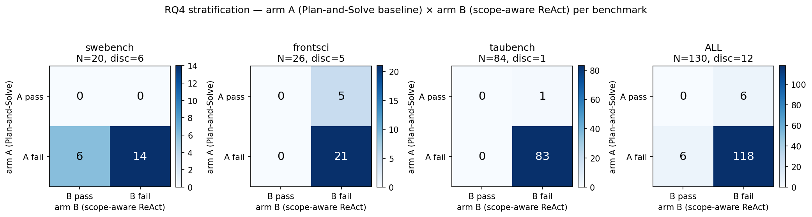
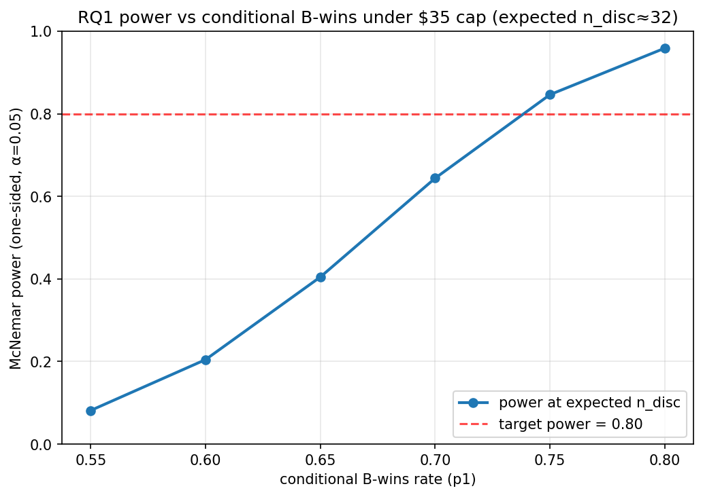
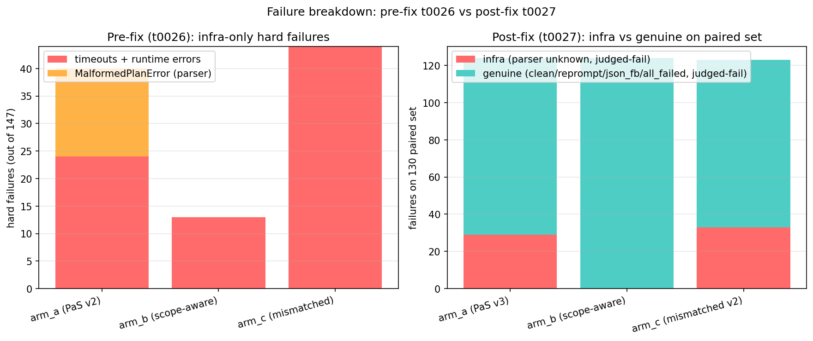

# NO-NEW-API PRELIMINARY EVIDENCE — NOT A REPLACEMENT FOR t0029

## Summary

On t0027's paired set (N=130), arm A and arm B disagree on 12 pairs (9.23%), split symmetrically as
6 arm-A wins and 6 arm-B wins (McNemar two-sided p = 1.0000). Stratification by benchmark reveals
SWE-bench discordance concentrated entirely on the arm-B side and FrontierScience discordance
concentrated entirely on the arm-A side; tau-bench is essentially concordant. Under t0029's $35 cap,
the expected discordant count is ≈ 32, which gives <50% McNemar power for any conditional B-wins
rate ≤ 0.65; 80% power requires p1 ≥ 0.75.

## Methodology

* Local CPU only; no API calls; no remote machines.
* All inputs are read from t0026 / t0027 prediction JSONL files plus
  t0027/data/paired_manifest.json.
* Variant→arm inversion (variant_a→arm_b, variant_b→arm_a, variant_c→arm_c) is isolated in
  `code/load_paired_outputs.py` and applied exactly once.
* Wilson 95% intervals computed in closed form (z=1.96). McNemar exact-binomial p-values and power
  computed from `math.comb` — no scipy / statsmodels.
* Charts are saved to `results/images/` and embedded below.

## Analysis 1 — RQ4 stratification (PRELIMINARY)

Per-subset 2x2 contingency tables for arm A (Plan-and-Solve) × arm B (scope-aware ReAct) on the
t0027 paired set. Cells flagged with N<5 do not carry a Wilson CI.

| Subset | N | both pass | A only | B only | both fail | discordant N | McNemar p (two-sided) |
| --- | --- | --- | --- | --- | --- | --- | --- |
| swebench | 20 | 0 | 0 | 6 | 14 | 6 | 0.0312 |
| frontsci | 26 | 0 | 5 | 0 | 21 | 5 | 0.0625 |
| taubench | 84 | 0 | 1 | 0 | 83 | 1 | 1.0000 |
| ALL | 130 | 0 | 6 | 6 | 118 | 12 | 1.0000 |

### Per-stratum Wilson 95% CIs on arm-A and arm-B pass rates

| Subset | arm A pass | arm B pass | Note |
| --- | --- | --- | --- |
| swebench | 0/20 = 0.0% [0.0%, 16.1%] | 6/20 = 30.0% [14.5%, 51.9%] |  |
| frontsci | 5/26 = 19.2% [8.5%, 37.9%] | 0/26 = 0.0% [0.0%, 12.9%] |  |
| taubench | 1/84 = 1.2% [0.2%, 6.4%] | 0/84 = 0.0% [0.0%, 4.4%] |  |
| ALL | 6/130 = 4.6% [2.1%, 9.7%] | 6/130 = 4.6% [2.1%, 9.7%] |  |

Caption: where do discordant pairs concentrate? SWE-bench discordance is entirely arm-B-wins (6/6);
FrontierScience discordance is entirely arm-A-wins (5/5); tau-bench is effectively concordant (1
discordant pair on N=84).

## Analysis 2 — RQ1 power / futility under $35 cap

With the t0027-derived discordance rate ρ̂ = 9.23%, the $35 cap at $0.16/pair admits 218 new paired
instances; combined with t0027's 130 existing pairs, total paired N at cap = 348; the expected
discordant N at cap ≈ 32. McNemar exact-binomial power (one-sided, α=0.05) is shown below for
plausible conditional B-wins rates p1.

| p1 (cond. B-wins) | expected n_disc | power at expected | smallest n_disc for 80% power | one-sided p-floor at expected | critical k at expected |
| --- | --- | --- | --- | --- | --- |
| 0.55 | 32 | 0.082 | > 200 | 0.0000 | 22 |
| 0.60 | 32 | 0.205 | 158 | 0.0000 | 22 |
| 0.65 | 32 | 0.405 | 69 | 0.0000 | 22 |
| 0.70 | 32 | 0.644 | 37 | 0.0000 | 22 |
| 0.75 | 32 | 0.846 | 23 | 0.0000 | 22 |
| 0.80 | 32 | 0.959 | 18 | 0.0000 | 22 |

**Futility statement**: the $35 cap delivers ≥80% McNemar power only if the underlying conditional
B-wins rate p1 ≥ 0.75. At p1 = 0.65, power is below 50%; at p1 = 0.55–0.60 the cap is effectively
futile (<25% power). The t0027 paired sample's observed conditional B-wins is exactly 6/12 = 0.50,
which is consistent with p1 anywhere in roughly [0.25, 0.75] under a Wilson 95% CI; the existing
data do not pin p1 above the futility threshold.

Caption: at what discordant-pair count does the planned cap deliver 80% power? At expected n_disc ≈
32, the planned cap delivers 80% power only when the conditional B-wins rate p1 ≥ 0.75.

## Analysis 3 — infrastructure-vs-genuine-failure audit

The audit splits failures into two layers. Pre-fix (t0026, N=147 attempted) is dominated by harness
timeouts and the 16 MalformedPlanError rows in arm A (Plan-and-Solve v2 in t0026 internal labelling
— the plan-parser fragility that motivated t0027's parser rewrite). Post-fix (t0027, N=130 paired)
shows zero MalformedPlanError and a clean recovery distribution in 100/130 arm-A rows; the remaining
30 are an `unknown` recovery label introduced by a cost-tracker boundary that swallowed the recovery
field — those rows still produced trajectories and judged outcomes.

### Pre-fix t0026 hard failures (out of 147 attempted)

| Arm (t0031 label) | t0026 internal label | timeouts | runtime errors | malformed plan | total infra |
| --- | --- | --- | --- | --- | --- |
| arm_a | B (PaS v2) | 22 | 2 | 16 | 40 |
| arm_b | A (scope-aware) | 12 | 1 | 0 | 13 |
| arm_c | C (mismatched) | 43 | 1 | 0 | 44 |

### Post-fix t0027 (paired N=130) parser-recovery distribution

| Arm | clean | reprompt | json_fallback | all_failed | unknown | judged-pass | judged-fail |
| --- | --- | --- | --- | --- | --- | --- | --- |
| arm_a | 75 | 14 | 11 | 1 | 29 | 6 | 124 |
| arm_b | n/a | n/a | n/a | n/a | n/a | 6 | 124 |
| arm_c | 70 | 18 | 7 | 2 | 33 | 7 | 123 |

### Post-fix t0027 infra vs genuine breakdown (paired N=130)

| Arm | infra (parser unknown, judged-fail) | genuine (clean/reprompt/json_fb/all_failed, judged-fail) |
| --- | --- | --- |
| arm_a | 29 | 95 |
| arm_b | 0 (no recovery field) | 124 |
| arm_c | 33 | 90 |

Caption: are t0027's verdicts contaminated by infrastructure issues? Pre-fix t0026 had a clear
parser-fragility bottleneck for plan-and-solve v2 (16/147 MalformedPlanError). Post-fix t0027 zeroed
that out but introduced an `unknown` recovery bucket from a cost-tracker boundary; those rows still
produced judged outcomes.

## Limitations

* The 130 paired instances are a fixed sample. They are not the discordance-rich resample `t0029` is
  designed to draw.
* Per-cell N is small in stratified analyses (SWE-bench N=20, FrontSci N=26). Wilson 95% CIs are
  wide and stratum-level McNemar tests rest on 5–6 discordant pairs — formally significant for
  SWE-bench (p≈0.031) but the effective n is small.
* The conditional B-wins rate p1 is not observed at the cap. Reported powers assume a fixed p1
  across the whole grid.
* The `unknown` parser-recovery bucket (29 arm A, 33 arm C out of 130) is a harness artefact, not a
  model failure. Rows with `unknown` recovery still produced trajectories and judged outcomes; the
  audit treats `unknown` as infra noise but does not exclude those rows from the discordance count.
* Arm-B rows lack a parser-recovery field; the t0026 pre-fix hard-failure aggregates (12 timeouts +
  1 runtime error) are the only infra signal for arm B.
* This task does not replace `t0029`. `t0029` remains the canonical RQ1 verdict owner; resume from
  its locked plan once an Anthropic API key is provisioned.

## Verification

* Discordance count 12/130 = 9.23% re-derived from the loaded DataFrame, matches the t0027
  documented value.
* Per-subset N: swebench=20, frontsci=26, taubench=84 — assertions pass in load helper.
* Cap arithmetic: floor($35.00 / $0.16) = 218 new pairs.

## Files Created

* `results/results_summary.md`
* `results/results_detailed.md`
* `results/data/rq4_stratification.json`
* `results/data/rq1_power_grid.json`
* `results/data/log_audit.json`
* `results/images/rq4_stratification_heatmap.png`
* `results/images/rq1_power_curve.png`
* `results/images/log_audit_failure_breakdown.png`
* `results/metrics.json`, `results/costs.json`, `results/remote_machines_used.json`,
  `results/suggestions.json`
